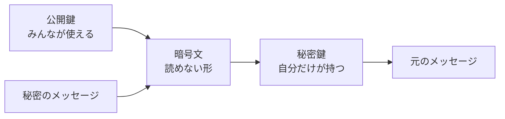

# 公開鍵暗号: 閉める鍵と開ける鍵を分けよう

公開鍵暗号は、暗号化に使う鍵と、復号に使う鍵を分ける考え方です。

「誰でも使える南京錠」は公開しておき、開けるための鍵だけを自分が持っているイメージです。

## ルール

1. 公開鍵はみんなに見せてよい
2. 秘密鍵は自分だけが持つ
3. 相手は公開鍵でメッセージを閉じる
4. 自分だけが秘密鍵で開けられる

## 図で見る



## コピペ用コード

これは学習用の小さな例です。実際のセキュリティには使わないでください。

```python
def encrypt(message, public_key, n):
    return pow(message, public_key, n)

def decrypt(cipher, private_key, n):
    return pow(cipher, private_key, n)

n = 33
public_key = 3
private_key = 7
message = 4

cipher = encrypt(message, public_key, n)
plain = decrypt(cipher, private_key, n)

print(cipher)
print(plain)
```

## コードの読み方

- `pow(message, public_key, n)` は「message を public_key 乗して n で割った余り」です。これが暗号化の正体です。
- 復号も同じ形で、秘密鍵を使ってもう一度べき乗するだけです。`(4^3)^7 % 33 = 4` のように、元の数に戻ります。
- この「公開鍵で閉じたものは、対になる秘密鍵でしか開かない」性質が、RSA暗号と呼ばれる仕組みの核です。

## なぜ安全なのか

公開鍵 `(3, 33)` は全世界に公開されます。それでも安全なのは、**秘密鍵を計算で求めるには `n` を素因数分解する必要がある** からです。

この例の `33 = 3 × 11` は一瞬で分解できますが、実際の RSA では `n` が 600 桁以上あり、現在のコンピュータでは現実的な時間で分解できません。[素因数分解](/docs/algorithms/prime-factorization/)の「難しさ」が、そのまま暗号の強さになっています。

## 別パターン1: 鍵ペアを自分で作ってみる

小さな素数で、鍵ペアを作るところから体験する例です。

```python
p, q = 3, 11
n = p * q                    # 33
phi = (p - 1) * (q - 1)      # 20

public_key = 3               # phi と互いに素な数を選ぶ

# 秘密鍵: (public_key * d) % phi == 1 になる d を探す
private_key = pow(public_key, -1, phi)
print(private_key)           # 7

message = 4
cipher = pow(message, public_key, n)
print(pow(cipher, private_key, n))  # 4 に戻る
```

- `phi = (p - 1) * (q - 1)` は、鍵ペアを作るための特別な数です。`p` と `q` を知らないと計算できません。
- `pow(public_key, -1, phi)` は「掛けて `phi` で割った余りが 1 になる数（逆元）」を求める Python の書き方です。
- 攻撃者は `n = 33` しか知らないので、`phi` が作れず、秘密鍵も作れません。

## 別パターン2: 文字列を1文字ずつ暗号化する

数字だけでなく文字も送れることを確かめる例です。

```python
def encrypt_text(text, public_key, n):
    return [pow(ord(ch), public_key, n) for ch in text]

def decrypt_text(cipher_list, private_key, n):
    return "".join(chr(pow(c, private_key, n)) for c in cipher_list)

# 文字コード(〜255)を扱える大きさの鍵
n = 3233          # 61 × 53
public_key = 17
private_key = 413

cipher = encrypt_text("hi", public_key, n)
print(cipher)                                  # [2170, 3179]
print(decrypt_text(cipher, private_key, n))    # hi
```

- `ord(ch)` で文字を数字にし、1文字ずつ暗号化しています。
- `n` は文字コードの最大値より大きい必要があるため、`33` より大きい `3233` を使っています。
- 実際の通信では1文字ずつではなく、もっと安全で効率的な方式が使われますが、「文字も数字にすれば暗号化できる」という感覚がつかめます。

## 共通鍵暗号との違い

| 方式 | 鍵 | 特徴 |
| :--- | :--- | :--- |
| 共通鍵暗号 | 閉める鍵と開ける鍵が同じ | 高速だが、鍵の受け渡しが難しい |
| 公開鍵暗号 | 閉める鍵と開ける鍵が別 | 鍵を公開できるが、計算が重い |

実際の HTTPS 通信では、まず公開鍵暗号で「共通鍵」を安全に受け渡し、その後は高速な共通鍵暗号で通信する、という合わせ技が使われています（[HTTPとHTTPS](/docs/development/http-https/)）。

## よくあるミス

| ミス | 何が起きるか | 対処 |
| :--- | :--- | :--- |
| メッセージが `n` 以上 | 余りを取った時点で情報が失われ、復号できない | `message < n` を守る |
| 学習用コードを実際のセキュリティに使う | 一瞬で破られる | 実務では検証済みライブラリを使う |
| 秘密鍵をコードに書いて公開する | 誰でも復号できてしまう | 鍵は[環境変数などで管理](/docs/development/accounts-and-api/)する |
