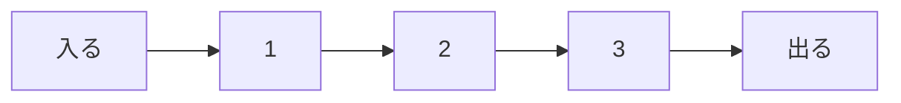

# キュー: 先に並んだものから取り出そう

キューは、レジ待ちの列のように、先に入ったものを先に取り出すデータ構造です。

この性質を `FIFO` と呼びます。`First In, First Out`、つまり「先に入ったものが先に出る」という意味です。

## 使いどころ

- 順番待ちの処理
- 幅優先探索
- 印刷ジョブの管理
- メッセージやタスクの処理

## 手順

1. 後ろからデータを入れる
2. 前からデータを取り出す
3. 先に並んだものほど早く処理される

## 図で見る



## コピペ用コード

```python
from collections import deque

queue = deque()
queue.append(1)
queue.append(2)
queue.append(3)

print(queue.popleft())
print(queue)
```

## コードの読み方

- `deque` は、両端から高速に出し入れできるデータ構造です。
- `append()` で後ろに追加します。
- `popleft()` で先頭から取り出します。

## 注意点

普通のリストで先頭を取り出すと遅くなることがあります。キューには `deque` を使うのが基本です。

## AOJで挑戦してみよう！

<div className="aojChallenge">
  <p className="aojChallenge__message">学んだレシピを実際に使って、ジャッジから「Accepted（正解）」を勝ち取ろう！</p>
  <div className="aojChallenge__links">
    <a className="aojChallenge__button" href="https://judge.u-aizu.ac.jp/onlinejudge/description.jsp?id=ALDS1_3_B&lang=ja" target="_blank" rel="noopener noreferrer">
      <span className="aojChallenge__label">ALDS1_3_B: Queue</span>
      <span className="aojChallenge__icon" aria-hidden="true">↗</span>
    </a>
  </div>
</div>
