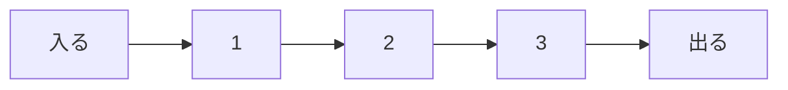

# キュー: 先に並んだものから取り出そう

キューは、レジ待ちの列のように、先に入ったものを先に取り出すデータ構造です。

この性質を `FIFO` と呼びます。`First In, First Out`、つまり「先に入ったものが先に出る」という意味です。

## 使いどころ

- 順番待ちの処理
- 幅優先探索
- 印刷ジョブの管理
- メッセージやタスクの処理

## 手順

1. 後ろからデータを入れる
2. 前からデータを取り出す
3. 先に並んだものほど早く処理される

## 図で見る



## コピペ用コード

```python
from collections import deque

queue = deque()
queue.append(1)
queue.append(2)
queue.append(3)

print(queue.popleft())
print(queue)
```

## コードの読み方

- `deque` は、両端から高速に出し入れできるデータ構造です。
- `append()` で後ろに追加します。
- `popleft()` で先頭から取り出します。

## 計算量

| 操作 | `deque` | 普通のリスト |
| :--- | :--- | :--- |
| 後ろに追加 | O(1) | O(1)（`append`） |
| 先頭から取り出し | O(1) | O(n)（`pop(0)`） |

普通のリストで `pop(0)` すると、残りの要素を全部1つずつ前にずらすため、データが多いほど遅くなります。キューには `deque` を使うのが基本です。

## 別パターン1: キューを使った順番待ちの処理

レジ待ちのように、「並んだ順に処理する」流れをそのまま書けます。

```python
from collections import deque

waiting = deque(["Aさん", "Bさん", "Cさん"])

while waiting:
    person = waiting.popleft()
    print(f"{person} を対応中")
```

- `deque(["Aさん", ...])` のように、最初から中身を入れて作れます。
- `while waiting` は、キューが空になるまでくり返すという意味です。空の `deque` は `False` として扱われます。

## 別パターン2: 幅優先探索でのキュー

キューの代表的な使い道が[幅優先探索](/docs/algorithms/breadth-first-search/)です。「近い場所から順に調べる」動きは、キューの「先に入れたものから取り出す」性質そのものです。

```python
from collections import deque

graph = {
    "A": ["B", "C"],
    "B": ["D"],
    "C": ["D"],
    "D": [],
}

queue = deque(["A"])
visited = {"A"}

while queue:
    node = queue.popleft()
    print(node)

    for next_node in graph[node]:
        if next_node not in visited:
            visited.add(next_node)
            queue.append(next_node)
```

- `visited` に追加してからキューに入れることで、同じ場所を2回調べないようにしています。
- 取り出す順番が「A → B → C → D」になり、スタート地点から近い順に処理されます。

## よくあるミス

| ミス | 何が起きるか | 対処 |
| :--- | :--- | :--- |
| リストの `pop(0)` を使う | データが多いと極端に遅い | `deque` の `popleft()` を使う |
| 空のキューから取り出す | `IndexError` で止まる | `while queue:` で空チェックしてから取り出す |
| スタック（後入れ先出し）と混同する | 処理の順番が逆になる | 取り出し順が「入れた順」かを確認する |

## AOJで挑戦してみよう！

<div className="aojChallenge">
  <p className="aojChallenge__message">学んだレシピを実際に使って、ジャッジから「Accepted（正解）」を勝ち取ろう！</p>
  <div className="aojChallenge__links">
    <a className="aojChallenge__button" href="https://judge.u-aizu.ac.jp/onlinejudge/description.jsp?id=ALDS1_3_B&lang=ja" target="_blank" rel="noopener noreferrer">
      <span className="aojChallenge__label">ALDS1_3_B: Queue</span>
      <span className="aojChallenge__icon" aria-hidden="true">↗</span>
    </a>
  </div>
</div>
