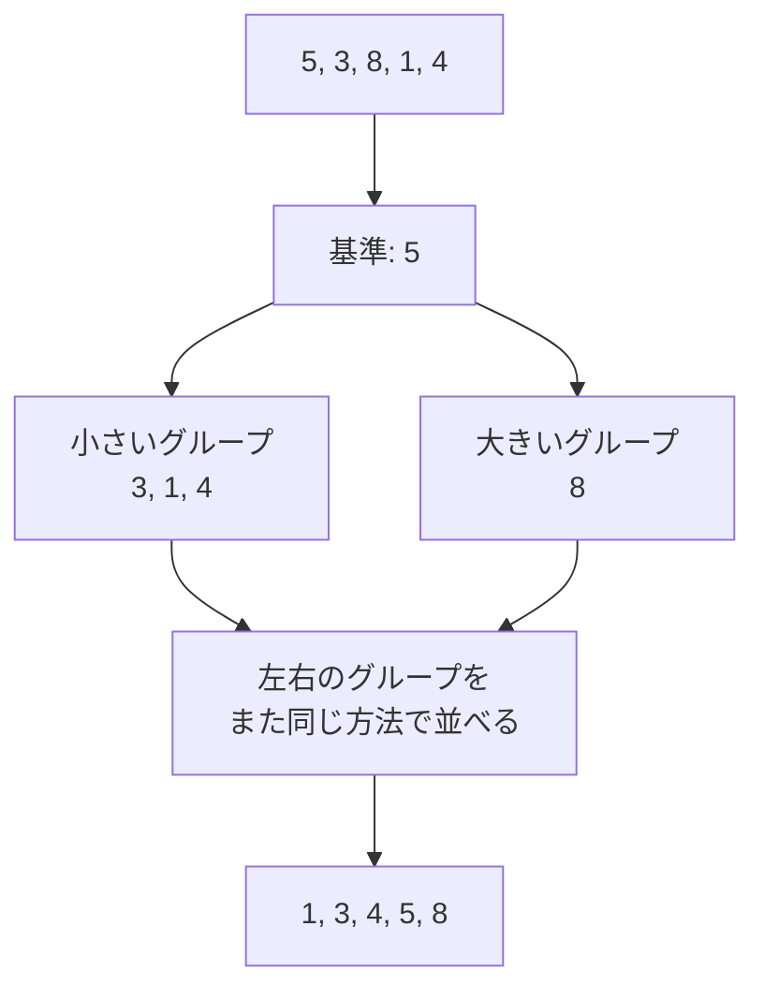

# クイックソート: 最強の並び替えを攻略せよ

クイックソートは、基準になる値を1つ選び、それより小さいグループと大きいグループに分けながら並び替える方法です。

バブルソートのように1つずつ隣を比べるのではなく、先にグループ分けしてから並べるので、たくさんの数字を並べるときに強い方法です。

## 考え方

1. 基準になる数字を1つ選ぶ
2. 基準より小さい数字を左のグループへ集める
3. 基準より大きい数字を右のグループへ集める
4. 左右のグループでも同じことをくり返す

## 図で見る



## コピペ用コード

```python
def quick_sort(numbers):
    if len(numbers) <= 1:
        return numbers

    pivot = numbers[0]
    smaller = []
    bigger = []

    for number in numbers[1:]:
        if number < pivot:
            smaller.append(number)
        else:
            bigger.append(number)

    return quick_sort(smaller) + [pivot] + quick_sort(bigger)

print(quick_sort([5, 3, 8, 1, 4]))
```

## AOJで挑戦してみよう！

<div className="aojChallenge">
  <p className="aojChallenge__message">学んだレシピを実際に使って、ジャッジから「Accepted（正解）」を勝ち取ろう！</p>
  <div className="aojChallenge__links">
    <a className="aojChallenge__button" href="https://judge.u-aizu.ac.jp/onlinejudge/description.jsp?id=ALDS1_6_C&lang=ja" target="_blank" rel="noopener noreferrer">
      <span className="aojChallenge__label">ALDS1_6_C: Quick Sort</span>
      <span className="aojChallenge__icon" aria-hidden="true">↗</span>
    </a>
  </div>
</div>
