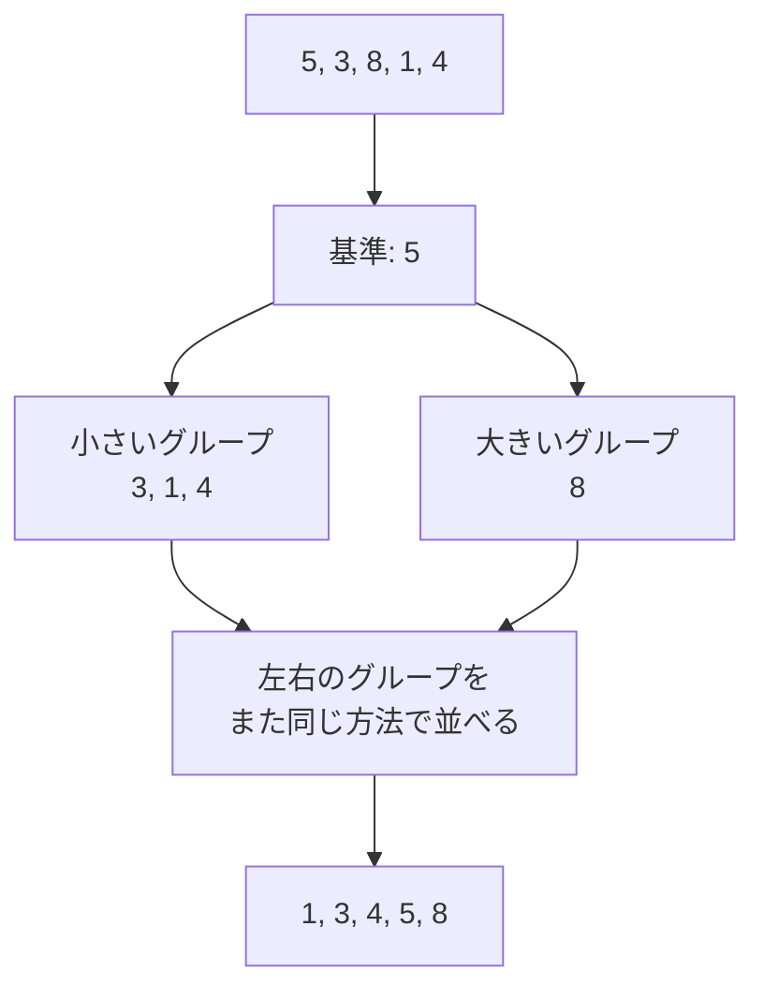

# クイックソート: 最強の並び替えを攻略せよ

クイックソートは、基準になる値を1つ選び、それより小さいグループと大きいグループに分けながら並び替える方法です。

バブルソートのように1つずつ隣を比べるのではなく、先にグループ分けしてから並べるので、たくさんの数字を並べるときに強い方法です。

## 考え方

1. 基準になる数字を1つ選ぶ
2. 基準より小さい数字を左のグループへ集める
3. 基準より大きい数字を右のグループへ集める
4. 左右のグループでも同じことをくり返す

## 図で見る



## コピペ用コード

```python
def quick_sort(numbers):
    if len(numbers) <= 1:
        return numbers

    pivot = numbers[0]
    smaller = []
    bigger = []

    for number in numbers[1:]:
        if number < pivot:
            smaller.append(number)
        else:
            bigger.append(number)

    return quick_sort(smaller) + [pivot] + quick_sort(bigger)

print(quick_sort([5, 3, 8, 1, 4]))
```

## コードの読み方

- `len(numbers) <= 1` は、もう分ける必要がない状態（止まる条件）です。
- `pivot = numbers[0]` で、先頭を基準（ピボット）に選んでいます。
- 残りの数を `smaller`（基準より小さい）と `bigger`（基準以上）に振り分けます。
- `quick_sort(smaller) + [pivot] + quick_sort(bigger)` で、「並んだ左＋基準＋並んだ右」をつなげます。左右の中身は[再帰](/docs/algorithms/recursion/)が並べてくれます。

## 計算量

| 状況 | 計算量 |
| :--- | :--- |
| 平均 | **O(n log n)** |
| 最悪（すでに並んだデータ＋先頭ピボット） | O(n²) |

グループ分けが毎回ほぼ半々になれば高速ですが、ピボットの選び方が悪いと「片方に全部寄る」を繰り返して遅くなります。すでに並んだデータに先頭ピボットを使うのが典型的な最悪ケースです。

## 別パターン1: ピボットをランダムに選ぶ

最悪ケースを避ける定番の対策が、ピボットのランダム化です。

```python
import random

def quick_sort_random(numbers):
    if len(numbers) <= 1:
        return numbers

    pivot = random.choice(numbers)
    smaller = [x for x in numbers if x < pivot]
    equal = [x for x in numbers if x == pivot]
    bigger = [x for x in numbers if x > pivot]

    return quick_sort_random(smaller) + equal + quick_sort_random(bigger)

print(quick_sort_random([5, 3, 8, 1, 4, 3]))  # [1, 3, 3, 4, 5, 8]
```

- `random.choice` でピボットを選ぶと、どんな並びのデータでも平均 O(n log n) が期待できます。
- `equal` グループを分けることで、同じ値がたくさんあるデータでも無駄な再帰が減ります。
- リスト内包表記で3グループを作る書き方は、Pythonらしく読みやすい形です。

## 別パターン2: その場で並べ替える（in-place版）

新しいリストを作らず、元の配列の中で入れ替える、教科書・AOJ提出でよく見る形です。

```python
def quick_sort_inplace(numbers, left=0, right=None):
    if right is None:
        right = len(numbers) - 1
    if left >= right:
        return

    pivot = numbers[right]          # 右端をピボットに
    i = left - 1

    for j in range(left, right):
        if numbers[j] <= pivot:
            i += 1
            numbers[i], numbers[j] = numbers[j], numbers[i]

    numbers[i + 1], numbers[right] = numbers[right], numbers[i + 1]
    pivot_index = i + 1

    quick_sort_inplace(numbers, left, pivot_index - 1)
    quick_sort_inplace(numbers, pivot_index + 1, right)

data = [5, 3, 8, 1, 4]
quick_sort_inplace(data)
print(data)  # [1, 3, 4, 5, 8]
```

- `i` は「ピボット以下の値を置いた最後の位置」です。小さい値を見つけるたびに左へ寄せます。
- 最後にピボットを正しい位置（`i + 1`）へ移動すると、その位置は確定します。
- 追加のリストを作らないためメモリ効率がよく、実際のライブラリのクイックソートに近い形です。

## 実務では sorted() を使う

Python の組み込み `sorted()` / `list.sort()` は、高速で安定なアルゴリズム（Timsort）を内蔵しています。実際の開発ではこちらを使い、クイックソートは「分割統治の考え方を学ぶ教材」と考えましょう。

```python
print(sorted([5, 3, 8, 1, 4]))                  # 昇順
print(sorted([5, 3, 8, 1, 4], reverse=True))    # 降順
```

## よくあるミス

| ミス | 何が起きるか | 対処 |
| :--- | :--- | :--- |
| ピボット自身を再帰に含める | 同じ値で無限再帰する | 基準は分割から除くか `equal` に分ける |
| 並んだデータに先頭ピボット | O(n²) に落ちて極端に遅い | ランダムピボットにする |
| in-place 版で境界の添字を間違える | 並びが壊れる・無限再帰 | `left >= right` の停止条件を確認する |

## AOJで挑戦してみよう！

<div className="aojChallenge">
  <p className="aojChallenge__message">学んだレシピを実際に使って、ジャッジから「Accepted（正解）」を勝ち取ろう！</p>
  <div className="aojChallenge__links">
    <a className="aojChallenge__button" href="https://judge.u-aizu.ac.jp/onlinejudge/description.jsp?id=ALDS1_6_C&lang=ja" target="_blank" rel="noopener noreferrer">
      <span className="aojChallenge__label">ALDS1_6_C: Quick Sort</span>
      <span className="aojChallenge__icon" aria-hidden="true">↗</span>
    </a>
  </div>
</div>
