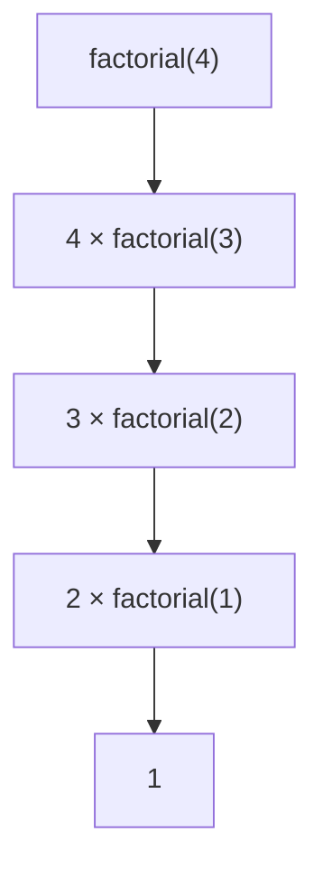

# 再帰関数: 自分自身を呼び出して問題を小さくしよう

再帰関数は、大きな問題を同じ形の小さな問題にして、自分自身を呼び出す書き方です。

ロシアのマトリョーシカ人形のように、中に同じ形の小さな問題が入っているイメージです。

## 使いどころ

- 階乗やフィボナッチ数
- 木構造の探索
- 深さ優先探索
- 分割統治アルゴリズム

## 手順

1. 問題を小さくする
2. 小さくした問題を同じ関数で解く
3. これ以上小さくできない条件を用意する
4. 戻りながら答えを作る

## 図で見る



## コピペ用コード

```python
def factorial(n):
    if n == 1:
        return 1
    return n * factorial(n - 1)

print(factorial(4))
```

## コードの読み方

- `if n == 1` は、再帰を止める条件です。
- `factorial(n - 1)` で、1つ小さい問題を解いています。
- `n * factorial(n - 1)` で、小さい答えを使って大きい答えを作っています。

## 別パターン1: フィボナッチ数とメモ化

再帰の定番、フィボナッチ数です。そのまま書くと同じ計算を何度もくり返して遅いので、「一度計算した答えを覚えておく（メモ化）」とセットで紹介します。

```python
from functools import lru_cache

@lru_cache(maxsize=None)
def fibonacci(n):
    if n <= 1:
        return n
    return fibonacci(n - 1) + fibonacci(n - 2)

print(fibonacci(50))  # 12586269025
```

- `@lru_cache` を関数の上につけるだけで、同じ引数の結果を自動で覚えてくれます。
- メモ化なしの `fibonacci(50)` は現実的な時間で終わりませんが、メモ化ありなら一瞬です。
- 「同じ形の小さい問題が何度も出てくる」再帰は、メモ化で劇的に速くなります。これは[動的計画法](/docs/algorithms/dynamic-programming/)の入口でもあります。

## 別パターン2: フォルダの中を全部たどる

再帰は数学の計算だけでなく、「入れ子になった構造」をたどるのにも向いています。

```python
folder = {
    "name": "project",
    "files": ["readme.md"],
    "children": [
        {
            "name": "src",
            "files": ["main.py", "utils.py"],
            "children": [],
        },
        {
            "name": "docs",
            "files": ["guide.md"],
            "children": [
                {"name": "images", "files": ["logo.png"], "children": []},
            ],
        },
    ],
}

def print_all_files(folder, indent=0):
    print(" " * indent + folder["name"] + "/")
    for file in folder["files"]:
        print(" " * (indent + 2) + file)
    for child in folder["children"]:
        print_all_files(child, indent + 2)

print_all_files(folder)
```

- フォルダの中にフォルダがある構造は、「同じ形の小さい問題」そのものです。
- `indent + 2` を渡すことで、深くなるほど字下げが増え、階層が見えるようにしています。
- 木構造をたどるこの形は、[深さ優先探索](/docs/algorithms/depth-first-search/)と同じ考え方です。

## 再帰とループの使い分け

| 向いている書き方 | 例 |
| :--- | :--- |
| ループで十分 | 合計、平均、単純なくり返し |
| 再帰が自然 | 木構造、入れ子の構造、分割統治、深さ優先探索 |

`factorial` のような単純な計算は、実はループでも書けます。再帰が本当に活きるのは、「構造自体が入れ子になっている」問題です。

## 再帰の深さ制限

Python では、再帰の深さに上限があります（既定でおよそ1000）。深い再帰が必要な場合は上限を広げられます。

```python
import sys
sys.setrecursionlimit(10 ** 6)
```

競技プログラミングで深い木やグラフをたどるときの定番設定です。ただし、そもそもループで書き直せないかも検討しましょう。

## よくあるミス

| ミス | 何が起きるか | 対処 |
| :--- | :--- | :--- |
| 止まる条件（ベースケース）がない | `RecursionError` で止まる | 最初にベースケースを書く |
| 問題が小さくなっていない | 無限に自分を呼び続ける | 引数が毎回小さくなるか確認する |
| 同じ計算を何度もする | 動くが極端に遅い | `lru_cache` などでメモ化する |
| 深い再帰で上限に達する | 正しいコードでもエラー | `setrecursionlimit` かループ化 |

## 注意点

止まる条件がないと、関数が自分を呼び続けてエラーになります。再帰を書くときは、「止まる条件」を最初に書く習慣をつけましょう。
