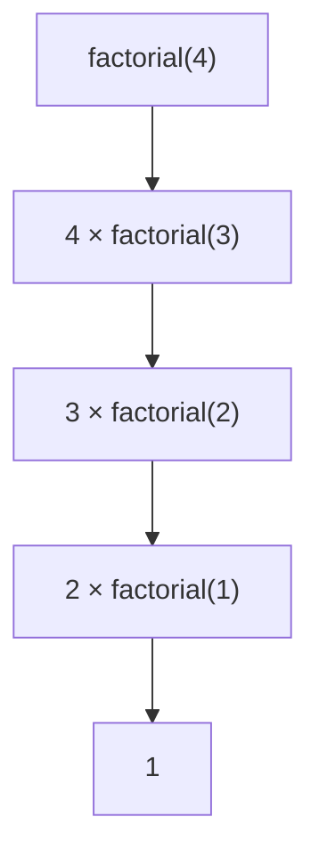

# 再帰関数: 自分自身を呼び出して問題を小さくしよう

再帰関数は、大きな問題を同じ形の小さな問題にして、自分自身を呼び出す書き方です。

ロシアのマトリョーシカ人形のように、中に同じ形の小さな問題が入っているイメージです。

## 使いどころ

- 階乗やフィボナッチ数
- 木構造の探索
- 深さ優先探索
- 分割統治アルゴリズム

## 手順

1. 問題を小さくする
2. 小さくした問題を同じ関数で解く
3. これ以上小さくできない条件を用意する
4. 戻りながら答えを作る

## 図で見る



## コピペ用コード

```python
def factorial(n):
    if n == 1:
        return 1
    return n * factorial(n - 1)

print(factorial(4))
```

## コードの読み方

- `if n == 1` は、再帰を止める条件です。
- `factorial(n - 1)` で、1つ小さい問題を解いています。
- `n * factorial(n - 1)` で、小さい答えを使って大きい答えを作っています。

## 注意点

止まる条件がないと、関数が自分を呼び続けてエラーになります。
