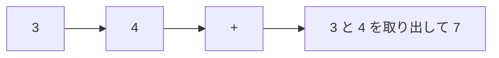

# 逆ポーランド記法: 後ろに演算子を書く式を計算しよう

逆ポーランド記法は、`3 4 +` のように、演算子を数字の後ろに書く記法です。スタックで計算しやすい形です。

普通の式では `3 + 4` と書きますが、逆ポーランド記法では「数字を先に置いて、あとから計算する」と考えます。

## 使いどころ

- 計算機の内部処理
- スタックの練習
- かっこを使わずに式を表す処理

## 手順

1. 数字ならスタックに積む
2. 演算子なら、スタックから数字を取り出す
3. 計算結果をまたスタックに積む
4. 最後に残った値が答え

## 図で見る



## コピペ用コード

```python
def calc(tokens):
    stack = []
    for token in tokens:
        if token == "+":
            stack.append(stack.pop() + stack.pop())
        else:
            stack.append(int(token))
    return stack.pop()


print(calc(["3", "4", "+"]))
```

## コードの読み方

- 数字を見つけたら `stack.append()` で積みます。
- `+` を見つけたら、直前の2つの数字を取り出して足します。
- 結果をまたスタックに戻すことで、次の計算に使えます。

## 注意点

引き算や割り算では、取り出す順番が重要です。`a - b` なのか `b - a` なのかを間違えないようにしましょう。

## 問いかけ

なぜスタックを使うと、かっこなしで計算できるのでしょう？
