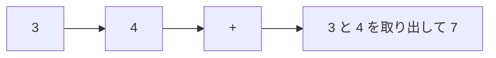

# 逆ポーランド記法: 後ろに演算子を書く式を計算しよう

逆ポーランド記法は、`3 4 +` のように、演算子を数字の後ろに書く記法です。スタックで計算しやすい形です。

普通の式では `3 + 4` と書きますが、逆ポーランド記法では「数字を先に置いて、あとから計算する」と考えます。

## 使いどころ

- 計算機の内部処理
- スタックの練習
- かっこを使わずに式を表す処理

## 手順

1. 数字ならスタックに積む
2. 演算子なら、スタックから数字を取り出す
3. 計算結果をまたスタックに積む
4. 最後に残った値が答え

## 図で見る



## コピペ用コード

```python
def calc(tokens):
    stack = []
    for token in tokens:
        if token == "+":
            stack.append(stack.pop() + stack.pop())
        else:
            stack.append(int(token))
    return stack.pop()

print(calc(["3", "4", "+"]))
```

## コードの読み方

- 数字を見つけたら `stack.append()` で積みます。
- `+` を見つけたら、直前の2つの数字を取り出して足します。
- 結果をまたスタックに戻すことで、次の計算に使えます。

## 別パターン1: 四則演算に対応した電卓

引き算・割り算では「取り出す順番」に注意が必要です。その対策込みの完成形です。

```python
def calc(tokens):
    stack = []

    for token in tokens:
        if token in ("+", "-", "*", "/"):
            b = stack.pop()   # 後に積んだ方が右側
            a = stack.pop()   # 先に積んだ方が左側

            if token == "+":
                stack.append(a + b)
            elif token == "-":
                stack.append(a - b)
            elif token == "*":
                stack.append(a * b)
            else:
                stack.append(a / b)
        else:
            stack.append(int(token))

    return stack.pop()

print(calc("10 2 -".split()))      # 8
print(calc("3 4 + 2 *".split()))   # 14
```

- 先に `b`、次に `a` を取り出すのがポイントです。スタックは後入れ先出しなので、後に積まれた方（右側の数）が先に出てきます。
- `"10 2 -"` は `10 - 2` の意味です。`a - b` の順で計算するため、`8` になります。
- `(3 + 4) × 2` は逆ポーランド記法だと `3 4 + 2 *`。**かっこが不要になる** のがこの記法の便利さです。

## 別パターン2: 普通の式を逆ポーランド記法に変換する

「かっこ付きの式」を逆ポーランド記法に変える、操車場アルゴリズム（Shunting Yard）の簡易版です。

```python
def to_rpn(tokens):
    priority = {"+": 1, "-": 1, "*": 2, "/": 2}
    output = []
    stack = []

    for token in tokens:
        if token in priority:
            while (stack and stack[-1] != "("
                   and priority.get(stack[-1], 0) >= priority[token]):
                output.append(stack.pop())
            stack.append(token)
        elif token == "(":
            stack.append(token)
        elif token == ")":
            while stack[-1] != "(":
                output.append(stack.pop())
            stack.pop()  # "(" を捨てる
        else:
            output.append(token)

    while stack:
        output.append(stack.pop())

    return output

rpn = to_rpn("( 3 + 4 ) * 2".split())
print(rpn)  # ['3', '4', '+', '2', '*']
# 別パターン1の calc に渡すと計算できる: calc(rpn) → 14
```

- 数字はそのまま出力へ、演算子は優先度を見ながらスタックで待たせます。
- `*` や `/` は `+` や `-` より優先度が高いので、先に出力されるよう制御しています。
- `to_rpn` と `calc` をつなげると、かっこ付きの式を計算できる「自作電卓」の完成です。

## 計算量

逆ポーランド記法の計算は、各トークンを1回ずつ処理するだけなので **O(n)** です。変換（操車場アルゴリズム）も O(n) です。

かっこの解析や優先度の判断を先に済ませてあるからこそ、計算段階がシンプルになります。プログラミング言語の内部でも、式はこれに近い形へ変換されてから実行されます。

## よくあるミス

| ミス | 何が起きるか | 対処 |
| :--- | :--- | :--- |
| `a` と `b` の取り出し順を逆にする | `10 2 -` が `-8` になる | 「後に出てくる方が右側」と覚える |
| トークンを1文字ずつ処理する | `10` が `1` と `0` に分かれる | `split()` で空白区切りにする |
| 演算子が来たのにスタックに数が足りない | `IndexError` で止まる | 入力の形式を確認する（式が壊れているサイン） |

## 注意点

引き算や割り算では、取り出す順番が重要です。`a - b` なのか `b - a` なのかを間違えないようにしましょう。
