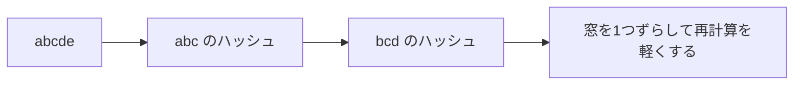

# ローリングハッシュ: 窓をずらしながら文字列を比べよう

ローリングハッシュは、文字列の区間ごとのハッシュ値を使って、部分文字列を高速に比べる方法です。

窓を1文字ずつずらしながら、区間の文字列を毎回作り直さずに数字として比べるイメージです。

## 使いどころ

- 同じ長さの部分文字列をたくさん比べる
- 文字列探索
- 重複する部分文字列を探す

## 手順

1. 文字を数字に変える
2. 最初の区間のハッシュ値を作る
3. 窓を1つ右へずらす
4. 古い文字を引き、新しい文字を足して更新する

## 図で見る



## コピペ用コード

```python
def rolling_hash(text, length):
    base = 31
    mod = 10**9 + 7
    value = 0
    power = pow(base, length, mod)  # 窓から出ていく文字の重み
    result = []

    for i, char in enumerate(text):
        value = (value * base + ord(char)) % mod
        if i >= length:
            value = (value - ord(text[i - length]) * power) % mod
        if i >= length - 1:
            result.append(value)
    return result

print(rolling_hash("abcde", 3))  # [96354, 97347, 98340]
```

## コードの読み方

- `value` は、今見ている区間のハッシュ値です。
- `base` は、文字の位置の重みを作るための数です。
- `mod` は、値が大きくなりすぎないようにするための余りです。
- `ord(char)` で文字を数字に変えています。
- 新しい文字を足すとき、既存の文字の重みは全体が `base` 倍されます。そのため、窓から出ていく文字は `base^length` の重みになっており、`power` はこの値にしておく必要があります。

## 計算量

長さ n の文字列から長さ m の区間をすべて調べるとき:

| 方法 | 計算量 |
| :--- | :--- |
| 毎回文字列を切り出して比較 | O(nm) |
| ローリングハッシュ | O(n + m) |

窓を1つずらす更新が O(1) で済むため、区間の数だけ文字列比較をやり直す必要がなくなります。

## 別パターン1: 文字列探索（ラビン・カープ法）

「文章の中からキーワードを探す」を、ローリングハッシュで高速化した形です。

```python
def rabin_karp(text, pattern):
    base = 31
    mod = 10**9 + 7
    m = len(pattern)

    if m > len(text):
        return -1

    power = pow(base, m, mod)  # 窓から出ていく文字の重み

    pattern_hash = 0
    for char in pattern:
        pattern_hash = (pattern_hash * base + ord(char)) % mod

    value = 0
    for i, char in enumerate(text):
        value = (value * base + ord(char)) % mod
        if i >= m:
            value = (value - ord(text[i - m]) * power) % mod
        if i >= m - 1 and value == pattern_hash:
            start = i - m + 1
            if text[start:start + m] == pattern:  # 衝突対策の本確認
                return start
    return -1

print(rabin_karp("hello code recipe", "code"))  # 6
```

- まずパターン側のハッシュ値を1回だけ計算します。
- 本文側は窓をずらしながらハッシュ値を更新し、一致した候補だけ、本物の文字列比較で確認します。
- ハッシュの一致は「たぶん同じ」であって「必ず同じ」ではないため、最後の本確認が大切です。

## 別パターン2: 同じ部分文字列が2回出てくるか

「長さ k の区間で、まったく同じものが2箇所以上あるか」を、ハッシュ値を集合に入れながら調べます。

```python
def has_duplicate_substring(text, k):
    base = 31
    mod = (1 << 61) - 1  # 大きな素数で衝突を減らす
    power = pow(base, k, mod)  # 窓から出ていく文字の重み

    seen = {}
    value = 0
    for i, char in enumerate(text):
        value = (value * base + ord(char)) % mod
        if i >= k:
            value = (value - ord(text[i - k]) * power) % mod
        if i >= k - 1:
            start = i - k + 1
            if value in seen and text[seen[value]:seen[value] + k] == text[start:start + k]:
                return True
            seen.setdefault(value, start)
    return False

print(has_duplicate_substring("abcabc", 3))  # True (abc が2回)
print(has_duplicate_substring("abcdef", 3))  # False
```

- `seen` に「ハッシュ値 → 最初に出た位置」を記録します。
- 同じハッシュ値が出たら、位置を使って本物同士を比較し、衝突による誤検出を防ぎます。
- `(1 << 61) - 1` のような大きな法を使うと、衝突の確率をぐっと下げられます。

## ハッシュ関数との関係

1つの文字列のハッシュを作る基本は[ハッシュ関数](/docs/algorithms/hash-function/)で説明しています。ローリングハッシュは、その計算を「窓をずらしても作り直さない」ように工夫したものです。

## よくあるミス

| ミス | 何が起きるか | 対処 |
| :--- | :--- | :--- |
| 引き算のあとに負の数を放置する | 言語によっては余りが負になりバグる | Python の `%` は非負に直してくれるが、他言語では `+ mod` してから `% mod` |
| 衝突を確認せず「一致」と断定する | まれに間違った答えを出す | 候補が見つかったら本物の文字列でも比較する |
| `base` や `mod` が小さすぎる | 衝突が頻発する | 大きな素数の `mod` を使う |
