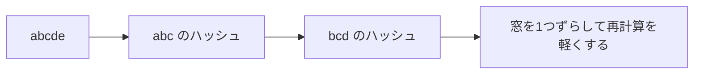

# ローリングハッシュ: 窓をずらしながら文字列を比べよう

ローリングハッシュは、文字列の区間ごとのハッシュ値を使って、部分文字列を高速に比べる方法です。

窓を1文字ずつずらしながら、区間の文字列を毎回作り直さずに数字として比べるイメージです。

## 使いどころ

- 同じ長さの部分文字列をたくさん比べる
- 文字列探索
- 重複する部分文字列を探す

## 手順

1. 文字を数字に変える
2. 最初の区間のハッシュ値を作る
3. 窓を1つ右へずらす
4. 古い文字を引き、新しい文字を足して更新する

## 図で見る



## コピペ用コード

```python
def rolling_hash(text, length):
    base = 31
    mod = 10**9 + 7
    value = 0
    power = pow(base, length - 1, mod)
    result = []

    for i, char in enumerate(text):
        value = (value * base + ord(char)) % mod
        if i >= length:
            value = (value - ord(text[i - length]) * power) % mod
        if i >= length - 1:
            result.append(value)
    return result


print(rolling_hash("abcde", 3))
```

## コードの読み方

- `value` は、今見ている区間のハッシュ値です。
- `base` は、文字の位置の重みを作るための数です。
- `mod` は、値が大きくなりすぎないようにするための余りです。
- `ord(char)` で文字を数字に変えています。

## 注意点

ハッシュ値が同じでも、文字列が必ず同じとは限りません。必要なら最後に本当に一致しているか確認します。

## 問いかけ

文字列を毎回切り出して比べる代わりに、数字で比べると何が速くなりますか？
