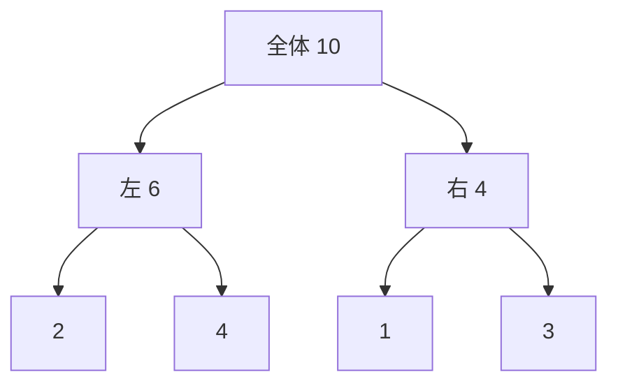

# セグメント木: 区間の情報を高速に更新しよう

セグメント木は、区間の合計や最小値を木の形で持ち、更新と検索を速くするデータ構造です。

配列をそのまま見るのではなく、区間ごとの情報をまとめた木を作るのがポイントです。

## 使いどころ

- 区間の合計を何度も聞かれる問題
- 区間の最小値や最大値を求める問題
- 値の更新が途中で発生する問題

## 手順

1. 一番下に元の配列を置く
2. 親のノードには、子どもの情報をまとめて入れる
3. 更新があったら、関係する親だけ直す
4. 区間を調べるときは、必要なノードだけ見る

## 図で見る



## コピペ用コード

```python
numbers = [2, 4, 1, 3]
tree = [0] * (len(numbers) * 2)
n = len(numbers)

for i, value in enumerate(numbers):
    tree[n + i] = value

for i in range(n - 1, 0, -1):
    tree[i] = tree[i * 2] + tree[i * 2 + 1]

print(tree[1])
```

## コードの読み方

- `tree[n + i]` に元の値を入れています。
- `tree[i] = tree[i * 2] + tree[i * 2 + 1]` で、子どもの合計を親に入れています。
- `tree[1]` は全体の合計です。

## 計算量

| 操作 | 普通の配列 | セグメント木 |
| :--- | :--- | :--- |
| 1箇所の更新 | O(1) | O(log n) |
| 区間の合計・最小値 | O(n) | O(log n) |

「更新」と「区間の質問」が両方たくさん来る問題で威力を発揮します。合計だけでよければ、より軽い [Binary Indexed Tree](/docs/algorithms/binary-indexed-tree/) も選択肢です。

## 別パターン1: 更新と区間合計まで含めた完成形

上の最小例に「更新」と「区間の合計」を足した、そのまま使えるクラスです。

```python
class SegmentTree:
    def __init__(self, numbers):
        self.n = len(numbers)
        self.tree = [0] * (self.n * 2)
        for i, value in enumerate(numbers):
            self.tree[self.n + i] = value
        for i in range(self.n - 1, 0, -1):
            self.tree[i] = self.tree[i * 2] + self.tree[i * 2 + 1]

    def update(self, index, value):
        """index 番目 (0始まり) を value に変更"""
        i = self.n + index
        self.tree[i] = value
        while i > 1:
            i //= 2
            self.tree[i] = self.tree[i * 2] + self.tree[i * 2 + 1]

    def query(self, left, right):
        """left 以上 right 未満の合計"""
        total = 0
        left += self.n
        right += self.n
        while left < right:
            if left % 2 == 1:
                total += self.tree[left]
                left += 1
            if right % 2 == 1:
                right -= 1
                total += self.tree[right]
            left //= 2
            right //= 2
        return total

st = SegmentTree([2, 4, 1, 3])
print(st.query(1, 3))  # 5 (4 + 1)

st.update(2, 10)       # 1 を 10 に変更
print(st.query(1, 3))  # 14 (4 + 10)
print(st.query(0, 4))  # 19 (全体)
```

- `update` は、葉を書き換えたあと、親をたどって合計を直します。木の高さぶん（log n 回）で終わります。
- `query` は、区間の両端から「必要なノードだけ」を拾いながら上へ登ります。
- 区間は「left 以上 right 未満」です。[累積和](/docs/algorithms/prefix-sum/)と同じ決めごとにしてあります。

## 別パターン2: 区間の最小値に変える

セグメント木の便利なところは、「合計」を「最小値」「最大値」に差し替えるだけで、同じ形が使えることです。

```python
class MinSegmentTree:
    INF = float("inf")

    def __init__(self, numbers):
        self.n = len(numbers)
        self.tree = [self.INF] * (self.n * 2)
        for i, value in enumerate(numbers):
            self.tree[self.n + i] = value
        for i in range(self.n - 1, 0, -1):
            self.tree[i] = min(self.tree[i * 2], self.tree[i * 2 + 1])

    def update(self, index, value):
        i = self.n + index
        self.tree[i] = value
        while i > 1:
            i //= 2
            self.tree[i] = min(self.tree[i * 2], self.tree[i * 2 + 1])

    def query(self, left, right):
        result = self.INF
        left += self.n
        right += self.n
        while left < right:
            if left % 2 == 1:
                result = min(result, self.tree[left])
                left += 1
            if right % 2 == 1:
                right -= 1
                result = min(result, self.tree[right])
            left //= 2
            right //= 2
        return result

st = MinSegmentTree([5, 2, 8, 3, 6])
print(st.query(0, 5))  # 2 (全体の最小)
print(st.query(2, 5))  # 3

st.update(3, 1)
print(st.query(2, 5))  # 1
```

- 変えたのは「`+` → `min`」と「初期値 `0` → `INF`」だけです。
- 合計・最小・最大のように「2つの結果を1つにまとめられる演算」なら、何でも同じ木に載せられます。

## よくあるミス

| ミス | 何が起きるか | 対処 |
| :--- | :--- | :--- |
| 木のサイズを `n` で確保する | 葉が入りきらず範囲外エラー | `n * 2` で確保する |
| 更新後に親を直し忘れる | 質問の答えが古いまま | 葉から根まで登って直す |
| 区間の「以上・未満」を混ぜる | 端が1個ずれる | query の区間の意味をコメントで固定する |
| 最小値の木の初期値を 0 にする | 空きの 0 が最小として答えに混ざる | 単位元（合計は 0、最小は INF）を使う |

## 注意点

このコードは「作るところ」だけの最小例です。実際には、区間を調べる関数や値を更新する関数を追加して使います（別パターン1が完成形です）。

## AOJで挑戦してみよう！

<div className="aojChallenge">
  <p className="aojChallenge__message">学んだレシピを実際に使って、ジャッジから「Accepted（正解）」を勝ち取ろう！</p>
  <div className="aojChallenge__links">
    <a className="aojChallenge__button" href="https://judge.u-aizu.ac.jp/onlinejudge/description.jsp?id=DSL_2_A&lang=ja" target="_blank" rel="noopener noreferrer">
      <span className="aojChallenge__label">DSL_2_A: Range Minimum Query</span>
      <span className="aojChallenge__icon" aria-hidden="true">↗</span>
    </a>
  </div>
</div>
