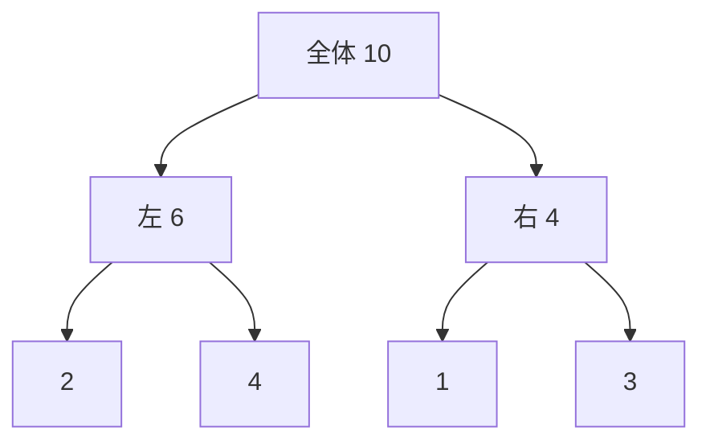

# セグメント木: 区間の情報を高速に更新しよう

セグメント木は、区間の合計や最小値を木の形で持ち、更新と検索を速くするデータ構造です。

配列をそのまま見るのではなく、区間ごとの情報をまとめた木を作るのがポイントです。

## 使いどころ

- 区間の合計を何度も聞かれる問題
- 区間の最小値や最大値を求める問題
- 値の更新が途中で発生する問題

## 手順

1. 一番下に元の配列を置く
2. 親のノードには、子どもの情報をまとめて入れる
3. 更新があったら、関係する親だけ直す
4. 区間を調べるときは、必要なノードだけ見る

## 図で見る



## コピペ用コード

```python
numbers = [2, 4, 1, 3]
tree = [0] * (len(numbers) * 2)
n = len(numbers)

for i, value in enumerate(numbers):
    tree[n + i] = value

for i in range(n - 1, 0, -1):
    tree[i] = tree[i * 2] + tree[i * 2 + 1]

print(tree[1])
```

## コードの読み方

- `tree[n + i]` に元の値を入れています。
- `tree[i] = tree[i * 2] + tree[i * 2 + 1]` で、子どもの合計を親に入れています。
- `tree[1]` は全体の合計です。

## 注意点

このコードは「作るところ」だけの最小例です。実際には、区間を調べる関数や値を更新する関数を追加して使います。

## AOJで挑戦してみよう！

<div className="aojChallenge">
  <p className="aojChallenge__message">学んだレシピを実際に使って、ジャッジから「Accepted（正解）」を勝ち取ろう！</p>
  <div className="aojChallenge__links">
    <a className="aojChallenge__button" href="https://judge.u-aizu.ac.jp/onlinejudge/description.jsp?id=DSL_2_A&lang=ja" target="_blank" rel="noopener noreferrer">
      <span className="aojChallenge__label">DSL_2_A: Range Minimum Query</span>
      <span className="aojChallenge__icon" aria-hidden="true">↗</span>
    </a>
  </div>
</div>
