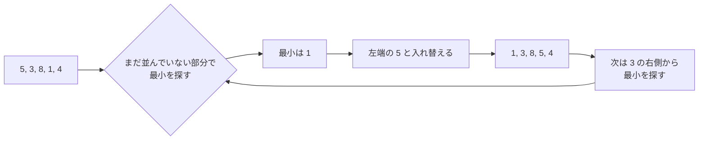

# 選択ソート: いちばん小さいカードを選び続けよう

選択ソートは、まだ並んでいない数字の中から「いちばん小さい数字」を選んで、前から順番に置いていく並び替えです。

トランプのカードを机に広げて、いちばん小さいカードを探して左端に置くイメージです。

## ルール

1. まだ並んでいない部分から、いちばん小さい数字を探す
2. 見つけた数字を、並べたい場所と入れ替える
3. 次の場所でも同じことをくり返す

## 図で見る



## コピペ用コード

```python
def selection_sort(numbers):
    result = numbers[:]

    for i in range(len(result)):
        min_index = i

        for j in range(i + 1, len(result)):
            if result[j] < result[min_index]:
                min_index = j

        result[i], result[min_index] = result[min_index], result[i]

    return result

print(selection_sort([5, 3, 8, 1, 4]))
```

## コードの読み方

- `result = numbers[:]` で元のリストをコピーし、元データを壊さないようにしています。
- 外側の `for i` は「次に確定させる場所」、内側の `for j` は「まだ並んでいない部分から最小値を探す」役割です。
- `min_index` に「今までで一番小さい値の場所」を覚えておき、探し終わってから1回だけ入れ替えます。

## 計算量

選択ソートの計算量は、データがどう並んでいても **O(n²)** です。

| 状態 | 比較回数 | 交換回数 |
| :--- | :--- | :--- |
| すでに並んでいる | n(n-1)/2 | 最大 n-1 回 |
| 逆順 | n(n-1)/2 | 最大 n-1 回 |

比較の回数は減らせませんが、**交換の回数が最大でも n-1 回** と少ないのが特徴です。「書き込みのコストが高い」記録媒体では、この性質が効くことがあります。

## 別パターン1: 大きい順に並べる

比較の向きを変えるだけで、降順ソートになります。

```python
def selection_sort_desc(numbers):
    result = numbers[:]

    for i in range(len(result)):
        max_index = i

        for j in range(i + 1, len(result)):
            if result[j] > result[max_index]:  # 向きを変えるだけ
                max_index = j

        result[i], result[max_index] = result[max_index], result[i]

    return result

print(selection_sort_desc([5, 3, 8, 1, 4]))  # [8, 5, 4, 3, 1]
```

- 変えたのは `<` を `>` にした1箇所だけです。「最小を選ぶ」が「最大を選ぶ」になります。

## 別パターン2: 動きを目で追えるバージョン

各ステップでリストがどう変わるかを表示します。アルゴリズムの動きを確認したいときに便利です。

```python
def selection_sort_verbose(numbers):
    result = numbers[:]

    for i in range(len(result)):
        min_index = i
        for j in range(i + 1, len(result)):
            if result[j] < result[min_index]:
                min_index = j

        result[i], result[min_index] = result[min_index], result[i]
        print(f"{i + 1}回目: {result} (確定: {result[:i + 1]})")

    return result

selection_sort_verbose([5, 3, 8, 1, 4])
# 1回目: [1, 3, 8, 5, 4] (確定: [1])
# 2回目: [1, 3, 8, 5, 4] (確定: [1, 3])
# 3回目: [1, 3, 4, 5, 8] (確定: [1, 3, 4])
# ...
```

- 左側が1つずつ「確定」していく様子が見えます。この「確定した部分が伸びていく」感覚が選択ソートの本質です。

## 他のソートとの使い分け

| ソート | 平均計算量 | 特徴 |
| :--- | :--- | :--- |
| 選択ソート | O(n²) | 交換回数が少ない。動きが分かりやすい |
| [挿入ソート](/docs/algorithms/insertion-sort/) | O(n²) | ほぼ並んでいるデータには速い |
| [クイックソート](/docs/algorithms/quick-sort/) | O(n log n) | 実用上もっとも速い部類 |

実務では Python の `sorted()` を使えば十分です。選択ソートは「並び替えの仕組みを理解する」ための教材と考えましょう。

## よくあるミス

| ミス | 何が起きるか | 対処 |
| :--- | :--- | :--- |
| 内側のループを `range(i, ...)` から始める | 自分自身と比較して無駄が出る | `i + 1` から始める |
| 見つけるたびに入れ替える | 動くが交換回数が増える | `min_index` を覚えて最後に1回入れ替える |
| コピーせず元のリストを書き換える | 呼び出し元のデータが変わってしまう | `numbers[:]` でコピーしてから操作する |

## AOJで挑戦してみよう！

<div className="aojChallenge">
  <p className="aojChallenge__message">学んだレシピを実際に使って、ジャッジから「Accepted（正解）」を勝ち取ろう！</p>
  <div className="aojChallenge__links">
    <a className="aojChallenge__button" href="https://judge.u-aizu.ac.jp/onlinejudge/description.jsp?id=ALDS1_2_B&lang=ja" target="_blank" rel="noopener noreferrer">
      <span className="aojChallenge__label">ALDS1_2_B: Selection Sort</span>
      <span className="aojChallenge__icon" aria-hidden="true">↗</span>
    </a>
  </div>
</div>
