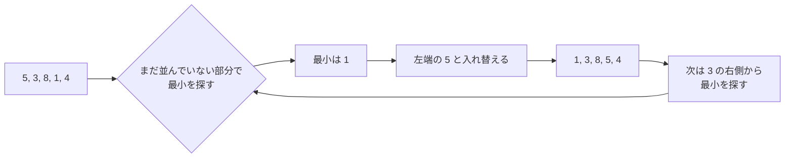

# 選択ソート: いちばん小さいカードを選び続けよう

選択ソートは、まだ並んでいない数字の中から「いちばん小さい数字」を選んで、前から順番に置いていく並び替えです。

トランプのカードを机に広げて、いちばん小さいカードを探して左端に置くイメージです。

## ルール

1. まだ並んでいない部分から、いちばん小さい数字を探す
2. 見つけた数字を、並べたい場所と入れ替える
3. 次の場所でも同じことをくり返す

## 図で見る



## コピペ用コード

```python
def selection_sort(numbers):
    result = numbers[:]

    for i in range(len(result)):
        min_index = i

        for j in range(i + 1, len(result)):
            if result[j] < result[min_index]:
                min_index = j

        result[i], result[min_index] = result[min_index], result[i]

    return result


print(selection_sort([5, 3, 8, 1, 4]))
```

## 問いかけ

最初に左端へ移動する数字はどれでしょう？
