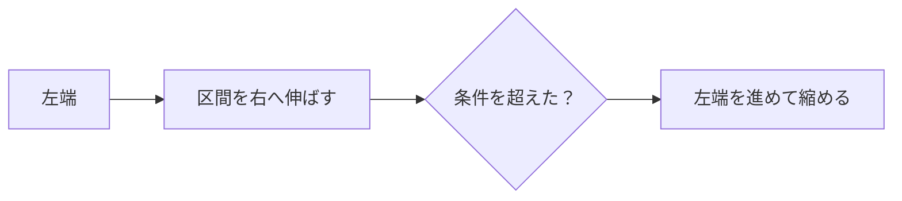

# しゃくとり法: 区間を伸ばしたり縮めたりしよう

しゃくとり法は、左端と右端を動かしながら、条件に合う区間を効率よく探す方法です。

物差しを伸ばしたり縮めたりするように、区間を少しずつ動かすので「しゃくとり法」と呼ばれます。

## 使いどころ

- 連続する区間の合計を調べる
- 条件を満たす最長区間や最短区間を探す
- 正の数だけの配列で区間を管理する

## 手順

1. 右端を動かして区間を伸ばす
2. 条件を超えたら左端を動かして縮める
3. 条件を満たす区間を記録する
4. 端だけを動かして効率よく調べる

## 図で見る



## コピペ用コード

```python
numbers = [2, 1, 3, 2, 4]
limit = 5
left = 0
total = 0

for right in range(len(numbers)):
    total += numbers[right]
    while total > limit:
        total -= numbers[left]
        left += 1
    print(left, right, total)
```

## コードの読み方

- `right` は区間の右端です。
- `left` は区間の左端です。
- `while total > limit` の間、左端を進めて区間を小さくします。

## 計算量

しゃくとり法の計算量は **O(n)** です。二重ループに見えますが、`left` も `right` も前にしか進まないため、それぞれ最大 n 回しか動きません。

すべての区間を試す方法（O(n²)）と比べると、データが10万件のとき、約10万倍の差になります。

## 別パターン1: 合計が limit 以下の最長区間を求める

「条件を満たす区間の中で、一番長いものはどれか」を求める、しゃくとり法の典型形です。

```python
numbers = [2, 1, 3, 2, 4]
limit = 6

left = 0
total = 0
best_length = 0

for right in range(len(numbers)):
    total += numbers[right]

    while total > limit:
        total -= numbers[left]
        left += 1

    best_length = max(best_length, right - left + 1)

print(best_length)  # 3 (区間 [1, 3, 2])
```

- `right - left + 1` が今の区間の長さです。
- 区間が条件を満たしている状態になってから、`best_length` を更新します。
- `max()` で「これまでの最長」と「今の長さ」の大きい方を残します。

## 別パターン2: 固定長の窓をずらす（固定ウィンドウ）

「連続する3日間の合計の最大値」のように、窓の長さが決まっているパターンです。毎回足し直さず、「入ってくる値を足し、出ていく値を引く」のがポイントです。

```python
temperatures = [22, 25, 21, 28, 30, 26, 24]
window_size = 3

current = sum(temperatures[:window_size])
best = current

for i in range(window_size, len(temperatures)):
    current += temperatures[i]              # 新しく入る値
    current -= temperatures[i - window_size]  # 出ていく値
    best = max(best, current)

print(best)  # 84 (28 + 30 + 26)
```

- 最初の窓だけ `sum()` で作り、あとは差分の足し引きだけで更新します。
- 1つずらすたびに O(1) で済むので、全体で O(n) です。

## よくあるミス

| ミス | 何が起きるか | 対処 |
| :--- | :--- | :--- |
| 負の数が混ざったデータに使う | 区間を伸ばしても合計が増えず、しぼり込みが壊れる | [累積和](/docs/algorithms/prefix-sum/)＋別の方法を検討する |
| 区間の長さを `right - left` と書く | 1短くなる | 両端を含むなら `right - left + 1` |
| `left` が `right` を追い越す場合を考えない | 空の区間で答えを更新してしまう | `while` の条件と更新のタイミングを確認する |

## 注意点

負の数が混ざると、右へ伸ばしたときに必ず合計が増えるとは限りません。その場合は別の方法が必要です。
