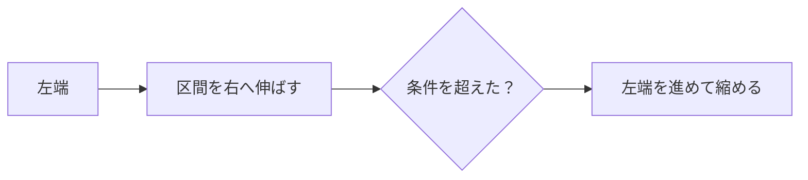

# しゃくとり法: 区間を伸ばしたり縮めたりしよう

しゃくとり法は、左端と右端を動かしながら、条件に合う区間を効率よく探す方法です。

物差しを伸ばしたり縮めたりするように、区間を少しずつ動かすので「しゃくとり法」と呼ばれます。

## 使いどころ

- 連続する区間の合計を調べる
- 条件を満たす最長区間や最短区間を探す
- 正の数だけの配列で区間を管理する

## 手順

1. 右端を動かして区間を伸ばす
2. 条件を超えたら左端を動かして縮める
3. 条件を満たす区間を記録する
4. 端だけを動かして効率よく調べる

## 図で見る



## コピペ用コード

```python
numbers = [2, 1, 3, 2, 4]
limit = 5
left = 0
total = 0

for right in range(len(numbers)):
    total += numbers[right]
    while total > limit:
        total -= numbers[left]
        left += 1
    print(left, right, total)
```

## コードの読み方

- `right` は区間の右端です。
- `left` は区間の左端です。
- `while total > limit` の間、左端を進めて区間を小さくします。

## 注意点

負の数が混ざると、右へ伸ばしたときに必ず合計が増えるとは限りません。その場合は別の方法が必要です。

## 問いかけ

毎回区間を作り直さず、端だけ動かすと何が速くなりますか？
