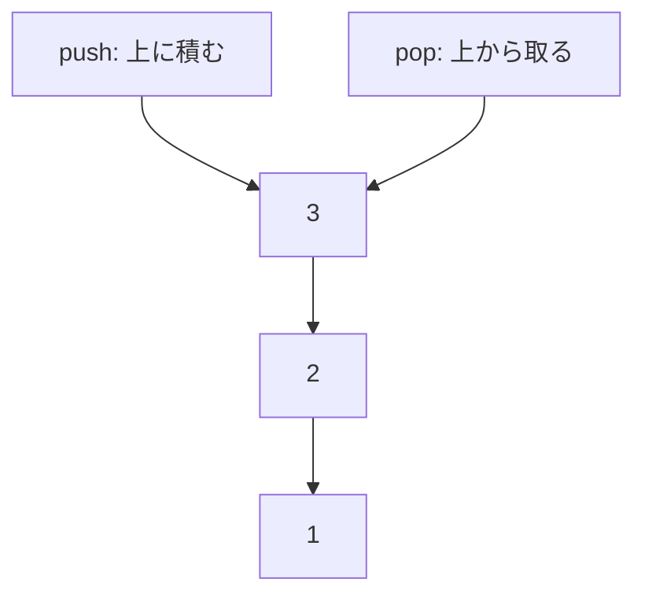

# スタック: 最後に入れたものから取り出そう

スタックは、積み重ねた本のように、最後に入れたものを最初に取り出すデータ構造です。

この性質を `LIFO` と呼びます。`Last In, First Out`、つまり「最後に入ったものが最初に出る」という意味です。

## 使いどころ

- ブラウザの戻る履歴
- 関数の呼び出し管理
- 深さ優先探索
- かっこが正しく閉じているかのチェック

## 手順

1. `push` で上に積む
2. `pop` で一番上から取り出す
3. 下にあるものは、上のものを取り出すまで出せない

## 図で見る



## コピペ用コード

```python
stack = []
stack.append(1)
stack.append(2)
stack.append(3)

print(stack.pop())
print(stack)
```

## コードの読み方

- Pythonのリストでは、`append()` が `push` の役割です。
- `pop()` は、最後に入れた値を取り出します。
- 取り出した値は、スタックから消えます。

## 注意点

空のスタックから `pop()` するとエラーになります。取り出す前に中身があるか確認しましょう。

## 問いかけ

ブラウザの「戻る」ボタンは、スタックに似ているでしょうか？
