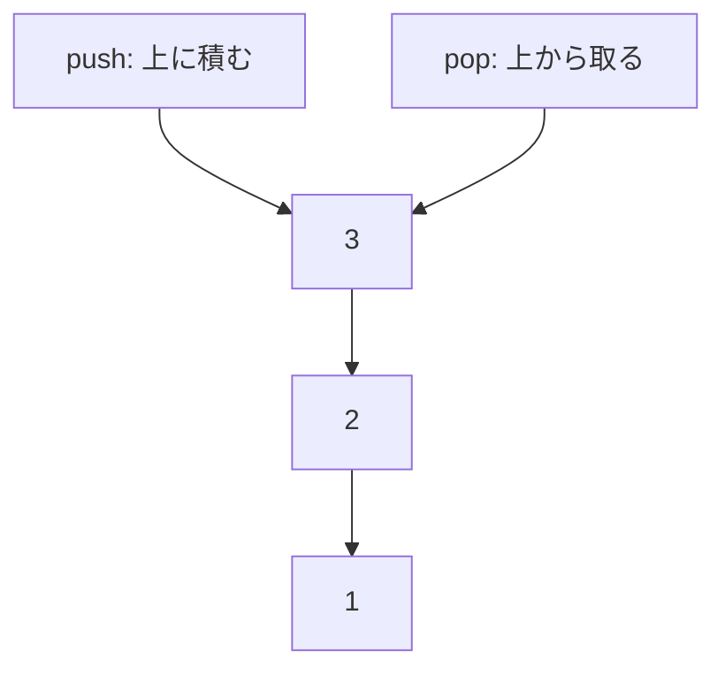

# スタック: 最後に入れたものから取り出そう

スタックは、積み重ねた本のように、最後に入れたものを最初に取り出すデータ構造です。

この性質を `LIFO` と呼びます。`Last In, First Out`、つまり「最後に入ったものが最初に出る」という意味です。

## 使いどころ

- ブラウザの戻る履歴
- 関数の呼び出し管理
- 深さ優先探索
- かっこが正しく閉じているかのチェック

## 手順

1. `push` で上に積む
2. `pop` で一番上から取り出す
3. 下にあるものは、上のものを取り出すまで出せない

## 図で見る



## コピペ用コード

```python
stack = []
stack.append(1)
stack.append(2)
stack.append(3)

print(stack.pop())
print(stack)
```

## コードの読み方

- Pythonのリストでは、`append()` が `push` の役割です。
- `pop()` は、最後に入れた値を取り出します。
- 取り出した値は、スタックから消えます。

## 計算量

| 操作 | 計算量 |
| :--- | :--- |
| push（`append`） | O(1) |
| pop | O(1) |
| 一番上を見るだけ（`stack[-1]`） | O(1) |

Python のリストは末尾の追加・削除が高速なので、そのままスタックとして使えます。[キュー](/docs/algorithms/queue/)と違い、`deque` に持ち替える必要はありません。

## 別パターン1: かっこの対応チェック

スタックの代表的な使い道です。「開きかっこを積んで、閉じかっこで取り出す」だけで、対応の正しさを判定できます。

```python
def is_balanced(text):
    pairs = {")": "(", "]": "[", "}": "{"}
    stack = []

    for char in text:
        if char in "([{":
            stack.append(char)
        elif char in ")]}":
            if not stack or stack.pop() != pairs[char]:
                return False

    return len(stack) == 0

print(is_balanced("(1 + [2 * 3])"))   # True
print(is_balanced("(1 + [2 * 3)]"))   # False (対応がねじれている)
print(is_balanced("((1 + 2)"))        # False (閉じ忘れ)
```

- 開きかっこはとりあえず積みます。
- 閉じかっこが来たら、一番上（＝一番最近開いたかっこ）と種類が合うか確認します。ここが LIFO の性質そのものです。
- 最後にスタックが空でなければ、閉じ忘れがあるということです。

## 別パターン2: 戻る機能（履歴）を作る

ブラウザの「戻る」のような機能は、スタック2本で作れます。

```python
history = []      # 戻る用
forward = []      # 進む用
current = "トップページ"

def visit(page):
    global current
    history.append(current)
    forward.clear()   # 新しいページに行ったら「進む」は消える
    current = page

def go_back():
    global current
    if history:
        forward.append(current)
        current = history.pop()

def go_forward():
    global current
    if forward:
        history.append(current)
        current = forward.pop()

visit("記事A")
visit("記事B")
go_back()
print(current)   # 記事A
go_forward()
print(current)   # 記事B
```

- 「戻る」は履歴スタックから取り出し、今のページを「進む」スタックへ退避します。
- 新しいページを開くと「進む」が消える動きも、実際のブラウザと同じです。
- テキストエディタの「元に戻す（Undo）／やり直し（Redo）」もまったく同じ構造です。

## よくあるミス

| ミス | 何が起きるか | 対処 |
| :--- | :--- | :--- |
| 空のスタックから `pop()` する | `IndexError` で止まる | `if stack:` で確認してから取り出す |
| 先頭から取り出してしまう（`pop(0)`） | キューの動きになり、しかも遅い | スタックは必ず末尾から `pop()` |
| 一番上を見るつもりで `pop()` する | 見るだけのつもりが消えてしまう | 見るだけなら `stack[-1]` |

## 注意点

空のスタックから `pop()` するとエラーになります。取り出す前に中身があるか確認しましょう。

## AOJで挑戦してみよう！

<div className="aojChallenge">
  <p className="aojChallenge__message">学んだレシピを実際に使って、ジャッジから「Accepted（正解）」を勝ち取ろう！</p>
  <div className="aojChallenge__links">
    <a className="aojChallenge__button" href="https://judge.u-aizu.ac.jp/onlinejudge/description.jsp?id=ALDS1_3_A&lang=ja" target="_blank" rel="noopener noreferrer">
      <span className="aojChallenge__label">ALDS1_3_A: Stack</span>
      <span className="aojChallenge__icon" aria-hidden="true">↗</span>
    </a>
  </div>
</div>
