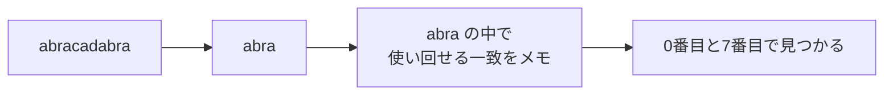

# 文字列探索: 文章からパターンを探そう

文字列探索は、長い文章の中から、探したい文字列がどこに出てくるかを調べる方法です。

KMP法は、途中まで一致した情報をメモしておき、失敗したときに戻りすぎないようにする工夫です。

普通に探すと、失敗するたびに次の位置から比べ直します。KMP法では「ここまでは同じだった」という情報を使って、無駄な比較を減らします。

## 使いどころ

- 長い文章から単語を探す
- DNA配列のような長い文字列を調べる
- ログやテキストの中からパターンを探す

## 手順

1. 探したい文字列から `lps` テーブルを作る
2. 本文とパターンを左から比べる
3. 失敗したら、`lps` を使ってパターンだけ戻す
4. すべて一致した位置を記録する

## 図で見る



## コピペ用コード

```python
def build_lps(pattern):
    lps = [0] * len(pattern)
    length = 0
    i = 1

    while i < len(pattern):
        if pattern[i] == pattern[length]:
            length += 1
            lps[i] = length
            i += 1
        elif length > 0:
            length = lps[length - 1]
        else:
            i += 1

    return lps

def kmp_search(text, pattern):
    lps = build_lps(pattern)
    positions = []
    i = 0
    j = 0

    while i < len(text):
        if text[i] == pattern[j]:
            i += 1
            j += 1

            if j == len(pattern):
                positions.append(i - j)
                j = lps[j - 1]
        elif j > 0:
            j = lps[j - 1]
        else:
            i += 1

    return positions

print(kmp_search("abracadabra", "abra"))  # [0, 7]
```

## コードの読み方

- `build_lps()` は、失敗したときにどこまで戻るかをメモします。
- `i` は本文の位置、`j` はパターンの位置です。
- 一致しなかったとき、`j = lps[j - 1]` で戻りすぎを防ぎます。
- `lps[k]` は「パターンの先頭 k+1 文字の中で、先頭と末尾が一致する最長の長さ」です。たとえば `"abra"` の lps は `[0, 0, 0, 1]` で、最後の `a` が先頭の `a` と同じ、という情報を持っています。

## 計算量

本文の長さを n、パターンの長さを m とします。

| 方法 | 計算量 | 特徴 |
| :--- | :--- | :--- |
| 素朴な方法（下記） | O(n × m) | 実装が簡単。短いパターンなら十分 |
| KMP法 | **O(n + m)** | 本文を1回なめるだけ。最悪ケースに強い |
| [ローリングハッシュ](/docs/algorithms/rolling-hash/) | O(n + m) | ハッシュで比較。複数パターンにも応用しやすい |

KMP法は本文の位置 `i` が決して戻らないのがポイントで、どんな意地悪な入力でも O(n + m) を保証します。

## 別パターン1: 素朴な方法（まずはここから）

KMP法のありがたみを知るには、素朴な方法と比べるのが一番です。

```python
def naive_search(text, pattern):
    positions = []
    n, m = len(text), len(pattern)

    for start in range(n - m + 1):
        if text[start:start + m] == pattern:
            positions.append(start)

    return positions

print(naive_search("abracadabra", "abra"))  # [0, 7]
```

- 「開始位置を1つずつずらして、そこからパターンと丸ごと比べる」だけです。
- `"aaaaaaaaab"` から `"aaab"` を探すような、途中まで一致しては失敗するケースで比較回数が膨らみます。KMP法はこの無駄を lps のメモで消します。

## 別パターン2: Pythonの標準機能で探す

実務でただ検索したいだけなら、まず標準機能を使いましょう。C言語で実装されており高速です。

```python
text = "abracadabra"

# 最初の位置だけ欲しいとき
print(text.find("abra"))     # 0
print(text.find("xyz"))      # -1 (見つからない)

# 含まれているかだけ知りたいとき
print("abra" in text)        # True

# すべての位置が欲しいとき
positions = []
start = 0
while True:
    index = text.find("abra", start)
    if index == -1:
        break
    positions.append(index)
    start = index + 1  # 重なりも探すなら +1、重なり不要なら + len("abra")

print(positions)  # [0, 7]

# 出現回数だけなら (重ならない範囲で)
print(text.count("abra"))  # 2
```

- `find(pattern, start)` の第2引数で「どこから探すか」を指定でき、繰り返せば全出現位置を列挙できます。
- KMP法を自分で書くのは、アルゴリズムの学習や、AOJのような「仕組みを理解して実装する」課題のときです。

## 別パターン3: lpsテーブルの中身を確認する

KMP法の理解のカギは lps テーブルです。いくつかのパターンで中身を見てみましょう。

```python
def build_lps(pattern):
    lps = [0] * len(pattern)
    length = 0
    i = 1
    while i < len(pattern):
        if pattern[i] == pattern[length]:
            length += 1
            lps[i] = length
            i += 1
        elif length > 0:
            length = lps[length - 1]
        else:
            i += 1
    return lps

print(build_lps("abra"))      # [0, 0, 0, 1]
print(build_lps("aabaaab"))   # [0, 1, 0, 1, 2, 2, 3]
print(build_lps("aaaa"))      # [0, 1, 2, 3]
print(build_lps("abcd"))      # [0, 0, 0, 0]
```

- `"aaaa"` のように繰り返しが多いほど lps の値が大きくなり、「失敗してもここまで一致は保証済み」と大きく使い回せます。
- `"abcd"` のように繰り返しがないと全部0で、失敗したら最初からやり直すしかない、という意味になります。

## よくあるミス

| ミス | 何が起きるか | 対処 |
| :--- | :--- | :--- |
| 一致成功後に `j = 0` に戻す | 重なった出現（`"aaa"` の中の `"aa"` など）を見逃す | `j = lps[j - 1]` で続きから探す |
| 失敗時に本文の `i` も戻す | O(n × m) に逆戻りする | i は進めるだけ。戻すのはパターン側の j |
| lps を「その文字までの一致数」と誤解する | テーブルの意味がずれて実装を間違える | 「先頭と末尾が重なる最長の長さ」と覚える |

## 注意点

KMP法は最初は難しく感じます。まずは「本文の位置をなるべく戻さない」工夫だと捉えましょう。

## AOJで挑戦してみよう！

<div className="aojChallenge">
  <p className="aojChallenge__message">学んだレシピを実際に使って、ジャッジから「Accepted（正解）」を勝ち取ろう！</p>
  <div className="aojChallenge__links">
    <a className="aojChallenge__button" href="https://judge.u-aizu.ac.jp/onlinejudge/description.jsp?id=ALDS1_14_A&lang=ja" target="_blank" rel="noopener noreferrer">
      <span className="aojChallenge__label">ALDS1_14_A: Naive String Search</span>
      <span className="aojChallenge__icon" aria-hidden="true">↗</span>
    </a>
  </div>
</div>
