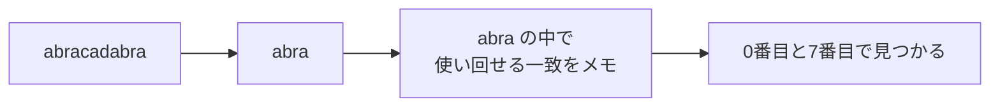

# 文字列探索: 文章からパターンを探そう

文字列探索は、長い文章の中から、探したい文字列がどこに出てくるかを調べる方法です。

KMP法は、途中まで一致した情報をメモしておき、失敗したときに戻りすぎないようにする工夫です。

普通に探すと、失敗するたびに次の位置から比べ直します。KMP法では「ここまでは同じだった」という情報を使って、無駄な比較を減らします。

## 使いどころ

- 長い文章から単語を探す
- DNA配列のような長い文字列を調べる
- ログやテキストの中からパターンを探す

## 手順

1. 探したい文字列から `lps` テーブルを作る
2. 本文とパターンを左から比べる
3. 失敗したら、`lps` を使ってパターンだけ戻す
4. すべて一致した位置を記録する

## 図で見る



## コピペ用コード

```python
def build_lps(pattern):
    lps = [0] * len(pattern)
    length = 0
    i = 1

    while i < len(pattern):
        if pattern[i] == pattern[length]:
            length += 1
            lps[i] = length
            i += 1
        elif length > 0:
            length = lps[length - 1]
        else:
            i += 1

    return lps

def kmp_search(text, pattern):
    lps = build_lps(pattern)
    positions = []
    i = 0
    j = 0

    while i < len(text):
        if text[i] == pattern[j]:
            i += 1
            j += 1

            if j == len(pattern):
                positions.append(i - j)
                j = lps[j - 1]
        elif j > 0:
            j = lps[j - 1]
        else:
            i += 1

    return positions

print(kmp_search("abracadabra", "abra"))
```

## コードの読み方

- `build_lps()` は、失敗したときにどこまで戻るかをメモします。
- `i` は本文の位置、`j` はパターンの位置です。
- 一致しなかったとき、`j = lps[j - 1]` で戻りすぎを防ぎます。

## 注意点

KMP法は最初は難しく感じます。まずは「本文の位置をなるべく戻さない」工夫だと捉えましょう。

## AOJで挑戦してみよう！

<div className="aojChallenge">
  <p className="aojChallenge__message">学んだレシピを実際に使って、ジャッジから「Accepted（正解）」を勝ち取ろう！</p>
  <div className="aojChallenge__links">
    <a className="aojChallenge__button" href="https://judge.u-aizu.ac.jp/onlinejudge/description.jsp?id=ALDS1_14_A&lang=ja" target="_blank" rel="noopener noreferrer">
      <span className="aojChallenge__label">ALDS1_14_A: Naive String Search</span>
      <span className="aojChallenge__icon" aria-hidden="true">↗</span>
    </a>
  </div>
</div>
