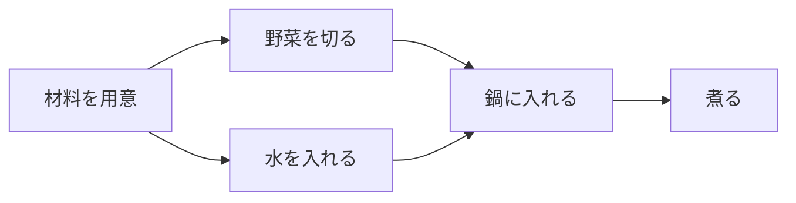

# トポロジカルソート: 作業の順番を決めよう

トポロジカルソートは、「Aをする前にBが必要」のような依存関係がある作業を、正しい順番に並べる方法です。

たとえば、料理で「野菜を切る」「鍋に入れる」「火をつける」の順番を守るようなイメージです。

## 使いどころ

- 作業の依存関係を整理する
- 授業やタスクの順番を決める
- 有向グラフで、先に終わらせるべきものを探す

## 手順

1. 各頂点に入ってくる矢印の数を数える
2. 入ってくる矢印が0の頂点から処理する
3. その頂点から出る矢印を消す
4. 新しく矢印が0になった頂点を処理する

## 図で見る



## コピペ用コード

```python
from collections import deque


def topological_sort(graph):
    indegree = [0] * len(graph)
    for edges in graph:
        for to in edges:
            indegree[to] += 1

    queue = deque([i for i, deg in enumerate(indegree) if deg == 0])
    order = []

    while queue:
        node = queue.popleft()
        order.append(node)

        for next_node in graph[node]:
            indegree[next_node] -= 1
            if indegree[next_node] == 0:
                queue.append(next_node)

    return order


graph = [[1, 3], [2], [4], [2], []]
print(topological_sort(graph))
```

## コードの読み方

- `indegree` は、その頂点に入ってくる矢印の数です。
- `indegree` が0なら、先に必要な作業がもうありません。
- 処理した頂点から出る矢印を消すことで、次にできる作業を探します。

## 計算量

各頂点と各辺を1回ずつ処理するだけなので **O(V + E)**（V: 頂点数、E: 辺の数）です。この方法は考案者の名前からカーン（Kahn）のアルゴリズムと呼ばれます。

## 別パターン1: 輪っか（循環依存）を検出する

依存関係に輪っかがあると順番を作れません。「並べられた頂点の数」を見れば検出できます。

```python
from collections import deque

def topological_sort_safe(graph):
    n = len(graph)
    indegree = [0] * n
    for edges in graph:
        for to in edges:
            indegree[to] += 1

    queue = deque([i for i, deg in enumerate(indegree) if deg == 0])
    order = []

    while queue:
        node = queue.popleft()
        order.append(node)
        for next_node in graph[node]:
            indegree[next_node] -= 1
            if indegree[next_node] == 0:
                queue.append(next_node)

    if len(order) < n:
        return None  # 輪っかがあって全部を並べられない
    return order

# 正常なグラフ
print(topological_sort_safe([[1, 3], [2], [4], [2], []]))
# [0, 1, 3, 2, 4]

# 輪っかのあるグラフ (0→1→2→0)
print(topological_sort_safe([[1], [2], [0]]))
# None
```

- 輪っかの中の頂点は `indegree` が0にならないため、キューに入らず `order` に残りません。
- `len(order) < n` が「循環依存あり」のサインです。ビルドツールが「circular dependency detected」と出すのはこの仕組みです。

## 別パターン2: 作業名（文字列）で使う実用形

実際のタスク管理では頂点は番号ではなく名前です。辞書ベースの形も用意しておくと便利です。

```python
from collections import deque

def topo_sort_names(dependencies):
    """dependencies[task] = そのタスクの前に必要なタスクのリスト"""
    indegree = {task: 0 for task in dependencies}
    graph = {task: [] for task in dependencies}

    for task, requires in dependencies.items():
        for req in requires:
            graph[req].append(task)  # req が終わると task に近づく
            indegree[task] += 1

    queue = deque([t for t, d in indegree.items() if d == 0])
    order = []

    while queue:
        task = queue.popleft()
        order.append(task)
        for next_task in graph[task]:
            indegree[next_task] -= 1
            if indegree[next_task] == 0:
                queue.append(next_task)

    return order

recipe = {
    "材料を用意": [],
    "野菜を切る": ["材料を用意"],
    "水を入れる": ["材料を用意"],
    "鍋に入れる": ["野菜を切る", "水を入れる"],
    "煮る": ["鍋に入れる"],
}

print(topo_sort_names(recipe))
# ['材料を用意', '野菜を切る', '水を入れる', '鍋に入れる', '煮る']
```

- 入力を「そのタスクの前に必要なもの」で書けるので、依存関係を自然に表現できます。
- 大学の履修条件、ソフトウェアのインストール順、CI/CDのジョブ順序など、実務での応用がとても広いアルゴリズムです。

## 別パターン3: 順番が何通りもあるとき

トポロジカルソートの答えは1通りとは限りません。上の例でも「野菜を切る」と「水を入れる」はどちらが先でも正解です。辞書順で一番小さい並びが欲しい場合は、キューを[優先度付きキュー](/docs/algorithms/priority-queue/)に変えます。

```python
import heapq

def topo_sort_smallest(graph):
    n = len(graph)
    indegree = [0] * n
    for edges in graph:
        for to in edges:
            indegree[to] += 1

    queue = [i for i, deg in enumerate(indegree) if deg == 0]
    heapq.heapify(queue)
    order = []

    while queue:
        node = heapq.heappop(queue)  # 一番小さい番号を先に
        order.append(node)
        for next_node in graph[node]:
            indegree[next_node] -= 1
            if indegree[next_node] == 0:
                heapq.heappush(queue, next_node)

    return order

graph = [[1, 3], [2], [4], [2], []]
print(topo_sort_smallest(graph))  # [0, 1, 3, 2, 4]
```

- `deque` を `heapq` に置き換えるだけで、「選べる中で一番小さい番号」を常に先に処理できます。

## よくあるミス

| ミス | 何が起きるか | 対処 |
| :--- | :--- | :--- |
| 輪っかのチェックをしない | 一部の頂点が結果から静かに消える | `len(order) == 頂点数` を確認する |
| 矢印の向きを逆に張る | 順番が逆になる | 「A → B は Aが先」と向きの意味を固定する |
| indegree の更新を忘れる | キューに何も追加されず途中で止まる | 頂点を処理したら行き先すべての indegree を減らす |

## 注意点

輪っかの依存関係があると、正しい順番を作れません。たとえば「Aの前にB、Bの前にA」は矛盾しています。

## AOJで挑戦してみよう！

<div className="aojChallenge">
  <p className="aojChallenge__message">学んだレシピを実際に使って、ジャッジから「Accepted（正解）」を勝ち取ろう！</p>
  <div className="aojChallenge__links">
    <a className="aojChallenge__button" href="https://judge.u-aizu.ac.jp/onlinejudge/description.jsp?id=GRL_4_B&lang=ja" target="_blank" rel="noopener noreferrer">
      <span className="aojChallenge__label">GRL_4_B: Topological Sort</span>
      <span className="aojChallenge__icon" aria-hidden="true">↗</span>
    </a>
  </div>
</div>
