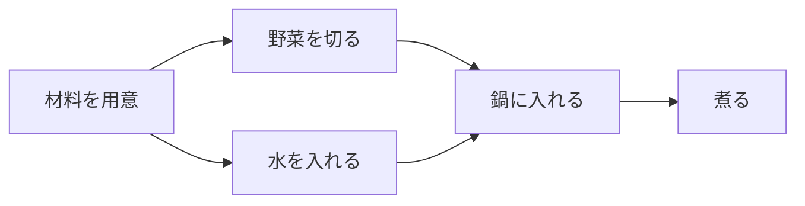

# トポロジカルソート: 作業の順番を決めよう

トポロジカルソートは、「Aをする前にBが必要」のような依存関係がある作業を、正しい順番に並べる方法です。

たとえば、料理で「野菜を切る」「鍋に入れる」「火をつける」の順番を守るようなイメージです。

## 使いどころ

- 作業の依存関係を整理する
- 授業やタスクの順番を決める
- 有向グラフで、先に終わらせるべきものを探す

## 手順

1. 各頂点に入ってくる矢印の数を数える
2. 入ってくる矢印が0の頂点から処理する
3. その頂点から出る矢印を消す
4. 新しく矢印が0になった頂点を処理する

## 図で見る



## コピペ用コード

```python
from collections import deque


def topological_sort(graph):
    indegree = [0] * len(graph)
    for edges in graph:
        for to in edges:
            indegree[to] += 1

    queue = deque([i for i, deg in enumerate(indegree) if deg == 0])
    order = []

    while queue:
        node = queue.popleft()
        order.append(node)

        for next_node in graph[node]:
            indegree[next_node] -= 1
            if indegree[next_node] == 0:
                queue.append(next_node)

    return order


graph = [[1, 3], [2], [4], [2], []]
print(topological_sort(graph))
```

## コードの読み方

- `indegree` は、その頂点に入ってくる矢印の数です。
- `indegree` が0なら、先に必要な作業がもうありません。
- 処理した頂点から出る矢印を消すことで、次にできる作業を探します。

## 注意点

輪っかの依存関係があると、正しい順番を作れません。たとえば「Aの前にB、Bの前にA」は矛盾しています。

## AOJで挑戦してみよう！

<div className="aojChallenge">
  <p className="aojChallenge__message">学んだレシピを実際に使って、ジャッジから「Accepted（正解）」を勝ち取ろう！</p>
  <div className="aojChallenge__links">
    <a className="aojChallenge__button" href="https://judge.u-aizu.ac.jp/onlinejudge/description.jsp?id=GRL_4_B&lang=ja" target="_blank" rel="noopener noreferrer">
      <span className="aojChallenge__label">GRL_4_B: Topological Sort</span>
      <span className="aojChallenge__icon" aria-hidden="true">↗</span>
    </a>
  </div>
</div>
