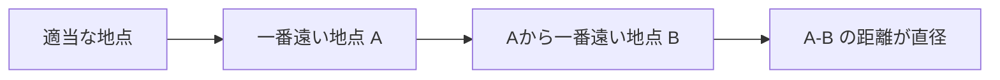

# 木の直径: 一番遠い地点を探そう

木の直径は、木構造のグラフで、もっとも遠い2つの頂点の距離を求める問題です。

木は「どの2点の間にも道が1つだけある」グラフです。迷路というより、枝分かれする一本道のネットワークをイメージすると分かりやすいです。

## 使いどころ

- 木構造のネットワークで一番遠い場所を探す
- DFSやBFSの応用練習
- グラフの距離を2回の探索で求める考え方の理解

## 手順

1. 好きな頂点から探索して、一番遠い頂点 `A` を探す
2. `A` からもう一度探索する
3. そのとき一番遠い頂点までの距離が木の直径になる

## 図で見る



## コピペ用コード

```python
from collections import deque


def farthest(start, graph):
    distance = [-1] * len(graph)
    distance[start] = 0
    queue = deque([start])

    while queue:
        node = queue.popleft()
        for next_node, cost in graph[node]:
            if distance[next_node] == -1:
                distance[next_node] = distance[node] + cost
                queue.append(next_node)

    far_node = max(range(len(graph)), key=lambda x: distance[x])
    return far_node, distance[far_node]


graph = [
    [(1, 2), (2, 3)],
    [(0, 2)],
    [(0, 3), (3, 4)],
    [(2, 4)],
]

a, _ = farthest(0, graph)
b, diameter = farthest(a, graph)
print(a, b, diameter)
```

## コードの読み方

- `farthest()` は、スタート地点から一番遠い頂点と距離を返します。
- 1回目の探索で直径の片端候補を見つけます。
- 2回目の探索で、実際の直径の長さを求めます。

## AOJで挑戦してみよう！

<div className="aojChallenge">
  <p className="aojChallenge__message">学んだレシピを実際に使って、ジャッジから「Accepted（正解）」を勝ち取ろう！</p>
  <div className="aojChallenge__links">
    <a className="aojChallenge__button" href="https://judge.u-aizu.ac.jp/onlinejudge/description.jsp?id=GRL_5_A&lang=ja" target="_blank" rel="noopener noreferrer">
      <span className="aojChallenge__label">GRL_5_A: Diameter of a Tree</span>
      <span className="aojChallenge__icon" aria-hidden="true">↗</span>
    </a>
  </div>
</div>
