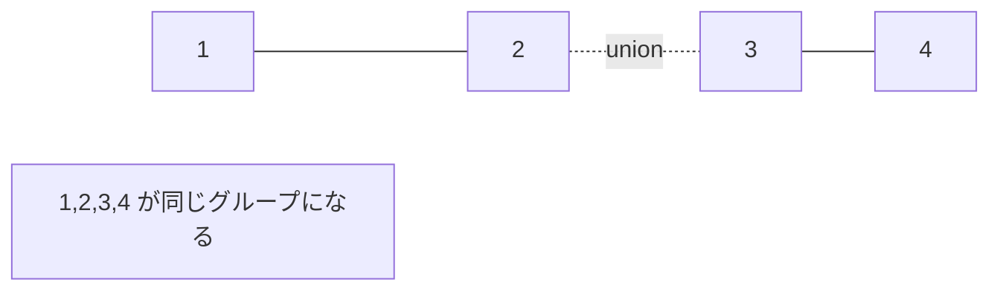

# Union-Find: グループのつながりを管理しよう

Union-Findは、要素どうしが同じグループにいるかを高速に調べるデータ構造です。

「この2人は同じチーム？」「この2つの島は橋でつながっている？」のような質問に強いです。

## 使いどころ

- 友だち関係やグループ分け
- 島や道路のつながり判定
- クラスカル法
- 競技プログラミングの連結判定

## 手順

1. 最初は全員が別々のグループ
2. `union` で2つのグループを合体する
3. `find` で自分がどの代表に属しているか調べる
4. 代表が同じなら同じグループ

## 図で見る



## コピペ用コード

```python
class UnionFind:
    def __init__(self, size):
        self.parent = list(range(size))

    def find(self, x):
        if self.parent[x] != x:
            self.parent[x] = self.find(self.parent[x])
        return self.parent[x]

    def union(self, a, b):
        self.parent[self.find(a)] = self.find(b)


uf = UnionFind(5)
uf.union(1, 2)
uf.union(2, 3)
print(uf.find(1) == uf.find(3))
```

## コードの読み方

- `parent[x]` は、`x` の親を表します。
- `find()` は、グループの代表を探します。
- `union()` は、片方の代表をもう片方の代表につなげています。
- `self.parent[x] = self.find(self.parent[x])` は、次回から速く探すための圧縮です。

## 注意点

本格的には、木が深くなりすぎないようにサイズやランクを使って合体します。このページでは考え方を優先しています。

## 問いかけ

友だち関係や島のつながりを調べるとき、どんな使い方ができそうですか？
