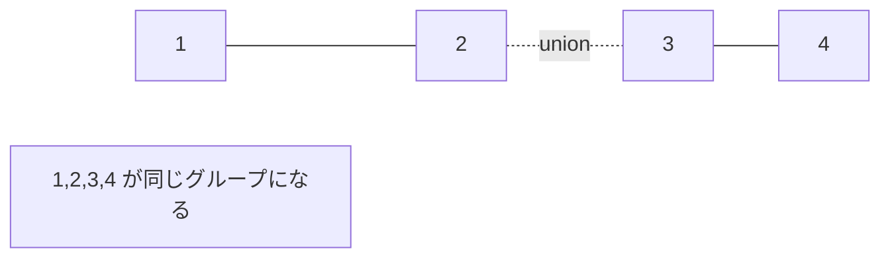

# Union-Find: グループのつながりを管理しよう

Union-Findは、要素どうしが同じグループにいるかを高速に調べるデータ構造です。

「この2人は同じチーム？」「この2つの島は橋でつながっている？」のような質問に強いです。

## 使いどころ

- 友だち関係やグループ分け
- 島や道路のつながり判定
- クラスカル法
- 競技プログラミングの連結判定

## 手順

1. 最初は全員が別々のグループ
2. `union` で2つのグループを合体する
3. `find` で自分がどの代表に属しているか調べる
4. 代表が同じなら同じグループ

## 図で見る



## コピペ用コード

```python
class UnionFind:
    def __init__(self, size):
        self.parent = list(range(size))

    def find(self, x):
        if self.parent[x] != x:
            self.parent[x] = self.find(self.parent[x])
        return self.parent[x]

    def union(self, a, b):
        self.parent[self.find(a)] = self.find(b)

uf = UnionFind(5)
uf.union(1, 2)
uf.union(2, 3)
print(uf.find(1) == uf.find(3))
```

## コードの読み方

- `parent[x]` は、`x` の親を表します。
- `find()` は、グループの代表を探します。
- `union()` は、片方の代表をもう片方の代表につなげています。
- `self.parent[x] = self.find(self.parent[x])` は、次回から速く探すための圧縮です。

## 計算量

経路圧縮（`find` のときに親を代表へ張り替える）とサイズによる合体を入れると、`find` も `union` も **ほぼ O(1)**（正確にはアッカーマン関数の逆関数で、実用上は定数）になります。

## 別パターン1: サイズつきの実用形

木が深くならないよう「小さいグループを大きいグループにつなぐ」改良を加えた、そのまま使える完成形です。グループの人数も調べられます。

```python
class UnionFind:
    def __init__(self, size):
        self.parent = list(range(size))
        self.size = [1] * size  # 各グループの人数 (代表のみ有効)

    def find(self, x):
        if self.parent[x] != x:
            self.parent[x] = self.find(self.parent[x])
        return self.parent[x]

    def union(self, a, b):
        root_a, root_b = self.find(a), self.find(b)
        if root_a == root_b:
            return False

        # 小さい方を大きい方につなぐ
        if self.size[root_a] < self.size[root_b]:
            root_a, root_b = root_b, root_a
        self.parent[root_b] = root_a
        self.size[root_a] += self.size[root_b]
        return True

    def same(self, a, b):
        return self.find(a) == self.find(b)

    def group_size(self, x):
        return self.size[self.find(x)]

uf = UnionFind(6)
uf.union(0, 1)
uf.union(1, 2)
uf.union(3, 4)

print(uf.same(0, 2))      # True
print(uf.same(0, 3))      # False
print(uf.group_size(0))   # 3 ({0, 1, 2})
print(uf.group_size(5))   # 1 (ひとりぼっち)
```

- `union` が「合体できたか」を返すので、[クラスカル法](/docs/algorithms/kruskal/)の輪っか判定にそのまま使えます。
- `group_size` で「同じグループは何人か」も O(1) で答えられます。

## 別パターン2: 友だちグループの判定に使う

「AとBは友だち」という情報がたくさん与えられ、「XとYは（間接的にでも）つながっているか」を答える典型問題です。

```python
class UnionFind:
    def __init__(self, size):
        self.parent = list(range(size))

    def find(self, x):
        if self.parent[x] != x:
            self.parent[x] = self.find(self.parent[x])
        return self.parent[x]

    def union(self, a, b):
        self.parent[self.find(a)] = self.find(b)

# 6人 (0〜5)。友だち関係を登録
friendships = [(0, 1), (1, 2), (3, 4)]

uf = UnionFind(6)
for a, b in friendships:
    uf.union(a, b)

# 質問に答える
questions = [(0, 2), (0, 3), (4, 3), (5, 5)]
for x, y in questions:
    if uf.find(x) == uf.find(y):
        print(f"{x} と {y} はつながっている")
    else:
        print(f"{x} と {y} はつながっていない")
# 0 と 2 はつながっている
# 0 と 3 はつながっていない
# 4 と 3 はつながっている
# 5 と 5 はつながっている
```

- 0-1、1-2 がつながれば、0-2 も自動的に同じグループです。この「間接的なつながり」を一瞬で判定できるのが Union-Find の価値です。
- 同じことを毎回[深さ優先探索](/docs/algorithms/depth-first-search/)で調べると、質問のたびに O(V + E) かかります。

## 別パターン3: グループの数を数える

「島が何個あるか」「ネットワークがいくつに分かれているか」を数える使い方です。

```python
class UnionFind:
    def __init__(self, size):
        self.parent = list(range(size))
        self.count = size  # グループ数

    def find(self, x):
        if self.parent[x] != x:
            self.parent[x] = self.find(self.parent[x])
        return self.parent[x]

    def union(self, a, b):
        root_a, root_b = self.find(a), self.find(b)
        if root_a != root_b:
            self.parent[root_a] = root_b
            self.count -= 1  # 合体するたびに1減る

uf = UnionFind(5)
print(uf.count)  # 5 (最初は全員バラバラ)

uf.union(0, 1)
uf.union(2, 3)
print(uf.count)  # 3 ({0,1}, {2,3}, {4})

uf.union(1, 2)
print(uf.count)  # 2 ({0,1,2,3}, {4})
```

- 最初のグループ数は人数と同じで、合体が成功するたびに1減ります。
- 「橋を1本ずつかけたとき、島はいくつになるか」のような問題がこの形です。

## よくあるミス

| ミス | 何が起きるか | 対処 |
| :--- | :--- | :--- |
| `parent[a] = b` と代表以外をつなぐ | グループ情報が壊れる | 必ず `find` した代表同士をつなぐ |
| `parent[x]` を直接比べる | 圧縮前だと代表でないことがある | 比較は必ず `find(x) == find(y)` で |
| 要素数を超える番号を使う | 範囲外エラー | 番号は 0〜size-1 に収める（名前なら辞書で番号に変換） |

## 注意点

本格的には、木が深くなりすぎないようにサイズやランクを使って合体します（別パターン1が完成形です）。

## AOJで挑戦してみよう！

<div className="aojChallenge">
  <p className="aojChallenge__message">学んだレシピを実際に使って、ジャッジから「Accepted（正解）」を勝ち取ろう！</p>
  <div className="aojChallenge__links">
    <a className="aojChallenge__button" href="https://judge.u-aizu.ac.jp/onlinejudge/description.jsp?id=DSL_1_A&lang=ja" target="_blank" rel="noopener noreferrer">
      <span className="aojChallenge__label">DSL_1_A: Disjoint Set Union</span>
      <span className="aojChallenge__icon" aria-hidden="true">↗</span>
    </a>
  </div>
</div>
