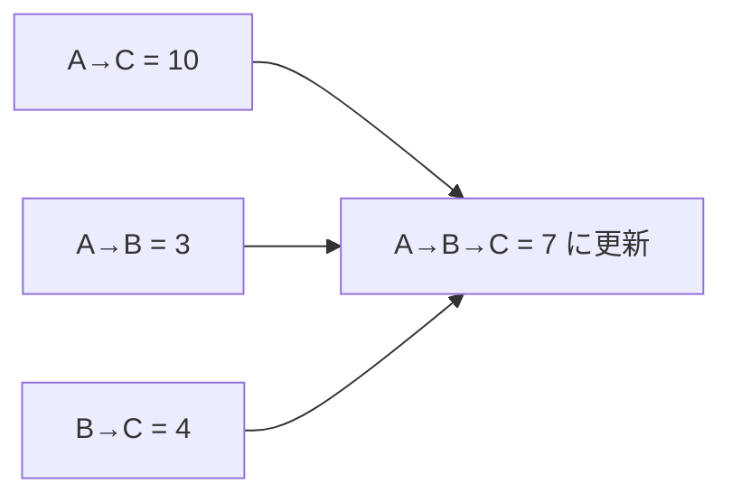

# ワーシャル・フロイド法: 全地点どうしの最短距離をまとめて出そう

ワーシャル・フロイド法は、「途中にこの地点を通ると短くなるか」を全組み合わせで調べる方法です。

1つのスタートだけではなく、すべての地点どうしの最短距離をまとめて知りたいときに使います。

## 使いどころ

- すべての町どうしの最短距離を知りたい
- 頂点数がそこまで多くないグラフ
- 経由地を使うと短くなるか調べたい

## 手順

1. 最初に直接行ける距離を表にする
2. 経由地 `k` を1つ決める
3. `i → j` より `i → k → j` が短いか調べる
4. すべての `k` についてくり返す

## 図で見る



## コピペ用コード

```python
INF = 10**9
dist = [
    [0, 3, 10],
    [INF, 0, 4],
    [INF, INF, 0],
]

for k in range(3):
    for i in range(3):
        for j in range(3):
            dist[i][j] = min(dist[i][j], dist[i][k] + dist[k][j])

print(dist)
```

## コードの読み方

- `dist[i][j]` は、`i` から `j` への今分かっている最短距離です。
- `k` は、途中で通ってよい地点です。
- `min(dist[i][j], dist[i][k] + dist[k][j])` で、経由したほうが短いか調べています。

## 計算量

3重ループなので `O(n^3)` です。頂点が多すぎる場合は重くなります。

## 問いかけ

「どこを経由してもよい」と考えると、なぜ全地点どうしの距離が分かるのでしょう？
