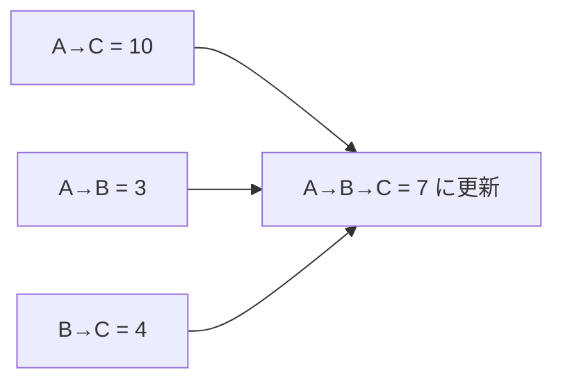

# ワーシャル・フロイド法: 全地点どうしの最短距離をまとめて出そう

ワーシャル・フロイド法は、「途中にこの地点を通ると短くなるか」を全組み合わせで調べる方法です。

1つのスタートだけではなく、すべての地点どうしの最短距離をまとめて知りたいときに使います。

## 使いどころ

- すべての町どうしの最短距離を知りたい
- 頂点数がそこまで多くないグラフ
- 経由地を使うと短くなるか調べたい

## 手順

1. 最初に直接行ける距離を表にする
2. 経由地 `k` を1つ決める
3. `i → j` より `i → k → j` が短いか調べる
4. すべての `k` についてくり返す

## 図で見る



## コピペ用コード

```python
INF = 10**9
dist = [
    [0, 3, 10],
    [INF, 0, 4],
    [INF, INF, 0],
]

for k in range(3):
    for i in range(3):
        for j in range(3):
            dist[i][j] = min(dist[i][j], dist[i][k] + dist[k][j])

print(dist)
```

## コードの読み方

- `dist[i][j]` は、`i` から `j` への今分かっている最短距離です。
- `k` は、途中で通ってよい地点です。
- `min(dist[i][j], dist[i][k] + dist[k][j])` で、経由したほうが短いか調べています。

## 計算量

3重ループなので `O(n^3)` です。頂点が多すぎる場合は重くなります。

| 頂点数 | ループ回数 | 現実的？ |
| :--- | :--- | :--- |
| 100 | 100万 | 余裕 |
| 500 | 1.25億 | ぎりぎり |
| 5,000 | 1250億 | 無理 → [ダイクストラ法](/docs/algorithms/dijkstra/)を全頂点から |

「頂点数がおよそ数百まで」が使いどころの目安です。コードが3行で書ける手軽さが最大の魅力です。

## 別パターン1: 辺のリストから距離表を作って解く完全版

実際の問題では、辺のリストから距離表を作るところから始まります。頂点名にも対応した形です。

```python
INF = float("inf")

nodes = ["A", "B", "C", "D"]
edges = [("A", "B", 3), ("B", "C", 4), ("A", "C", 10), ("C", "D", 2)]

n = len(nodes)
index = {name: i for i, name in enumerate(nodes)}

# 距離表の初期化: 自分自身は0、それ以外はINF
dist = [[INF] * n for _ in range(n)]
for i in range(n):
    dist[i][i] = 0
for a, b, cost in edges:
    dist[index[a]][index[b]] = cost
    dist[index[b]][index[a]] = cost  # 双方向の道の場合

for k in range(n):
    for i in range(n):
        for j in range(n):
            if dist[i][k] + dist[k][j] < dist[i][j]:
                dist[i][j] = dist[i][k] + dist[k][j]

print(dist[index["A"]][index["D"]])  # 9 (A→B→C→D)
print(dist[index["B"]][index["D"]])  # 6 (B→C→D)
```

- `dist[i][i] = 0`（自分への距離は0）を忘れないのがポイントです。
- 一方通行の道なら `dist[index[b]][index[a]]` の行を消します。
- ループの順番は必ず「k が一番外側」です。「経由地を1つずつ解禁していく」イメージです。

## 別パターン2: 経路の復元

「最短距離」だけでなく「どこを通るか」も知りたい場合は、`next_node` 表を持ちます。

```python
INF = float("inf")
n = 4
dist = [
    [0, 3, 10, INF],
    [3, 0, 4, INF],
    [10, 4, 0, 2],
    [INF, INF, 2, 0],
]

# next_node[i][j] = i から j へ行くとき最初に向かう頂点
next_node = [[j if dist[i][j] != INF else None for j in range(n)] for i in range(n)]

for k in range(n):
    for i in range(n):
        for j in range(n):
            if dist[i][k] + dist[k][j] < dist[i][j]:
                dist[i][j] = dist[i][k] + dist[k][j]
                next_node[i][j] = next_node[i][k]  # まず k 方面へ

def build_path(start, goal):
    if next_node[start][goal] is None:
        return None
    path = [start]
    while path[-1] != goal:
        path.append(next_node[path[-1]][goal])
    return path

print(build_path(0, 3))  # [0, 1, 2, 3]
```

- 距離を更新したとき、「i からの一歩目」を「k 方面への一歩目」に置き換えます。
- 経路は `next_node` を一歩ずつたどるだけで復元できます。

## 別パターン3: 「つながっているか」だけ調べる

距離の代わりに True/False で持つと、「行けるかどうか」の表（推移閉包）になります。

```python
n = 4
reach = [[False] * n for _ in range(n)]
for i in range(n):
    reach[i][i] = True

# 一方通行の道: 0→1, 1→2, 2→3
for a, b in [(0, 1), (1, 2), (2, 3)]:
    reach[a][b] = True

for k in range(n):
    for i in range(n):
        for j in range(n):
            if reach[i][k] and reach[k][j]:
                reach[i][j] = True

print(reach[0][3])  # True (0→1→2→3)
print(reach[3][0])  # False (逆向きには行けない)
```

- `min` の代わりに「k 経由で行けるなら行ける」という論理和になっています。
- 「AさんはBさんの間接的なフォロワーか」のような、つながりの判定にも使えます。

## よくあるミス

| ミス | 何が起きるか | 対処 |
| :--- | :--- | :--- |
| k を内側のループにする | 一部の経由が反映されず答えがずれる | k → i → j の順を守る |
| `dist[i][i] = 0` を忘れる | 自分経由の変な更新が起きる | 初期化で対角線を0にする |
| INF に足し算してあふれる | 他言語ではオーバーフローで負になる | Python は問題ないが、他言語では `INF/2` などにする |
| 負閉路があるのに使う | 対角線が負になる | `dist[i][i] < 0` の頂点があれば負閉路と判定できる |

## AOJで挑戦してみよう！

<div className="aojChallenge">
  <p className="aojChallenge__message">学んだレシピを実際に使って、ジャッジから「Accepted（正解）」を勝ち取ろう！</p>
  <div className="aojChallenge__links">
    <a className="aojChallenge__button" href="https://judge.u-aizu.ac.jp/onlinejudge/description.jsp?id=GRL_1_C&lang=ja" target="_blank" rel="noopener noreferrer">
      <span className="aojChallenge__label">GRL_1_C: All Pairs Shortest Path</span>
      <span className="aojChallenge__icon" aria-hidden="true">↗</span>
    </a>
  </div>
</div>
