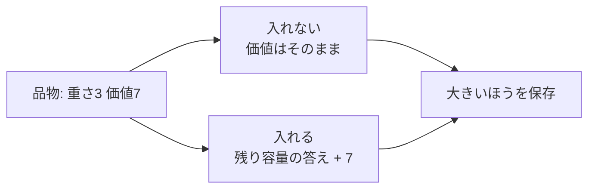

# 0-1ナップザック問題: カバンに入れる宝物を選ぼう

0-1ナップザック問題は、重さの制限があるカバンに、価値の高い品物をできるだけうまく入れる問題です。

各品物は「入れる」か「入れない」かのどちらかです。半分だけ入れることはできないので、0-1と呼ばれます。

## 使いどころ

- 限られた予算や容量で最大の成果を選ぶ問題
- 動的計画法の代表的な練習問題
- 「選ぶ・選ばない」の判断を表にして整理する問題

## 手順

1. `dp[w]` を「重さ `w` まで使えるときの最大価値」と考える
2. 品物を1つずつ見る
3. 入れられる重さなら、入れた場合と入れない場合を比べる
4. 大きい価値を保存する

## 図で見る



## コピペ用コード

```python
def knapsack(items, capacity):
    dp = [0] * (capacity + 1)

    for weight, value in items:
        for w in range(capacity, weight - 1, -1):
            dp[w] = max(dp[w], dp[w - weight] + value)

    return dp[capacity]


items = [(2, 3), (3, 4), (4, 5)]
print(knapsack(items, 5))
```

## コードの読み方

- `dp[w]` は、重さ `w` まで使えるときの最大価値です。
- `dp[w - weight] + value` は、その品物を入れた場合の価値です。
- `range(capacity, weight - 1, -1)` と逆順に見ることで、同じ品物を2回使わないようにしています。

## 注意点

逆順に更新するのが重要です。小さい重さから更新すると、同じ品物を何度も入れたことになってしまいます。

## AOJで挑戦してみよう！

<div className="aojChallenge">
  <p className="aojChallenge__message">学んだレシピを実際に使って、ジャッジから「Accepted（正解）」を勝ち取ろう！</p>
  <div className="aojChallenge__links">
    <a className="aojChallenge__button" href="https://judge.u-aizu.ac.jp/onlinejudge/description.jsp?id=DPL_1_B&lang=ja" target="_blank" rel="noopener noreferrer">
      <span className="aojChallenge__label">DPL_1_B: 0-1 Knapsack Problem</span>
      <span className="aojChallenge__icon" aria-hidden="true">↗</span>
    </a>
  </div>
</div>
