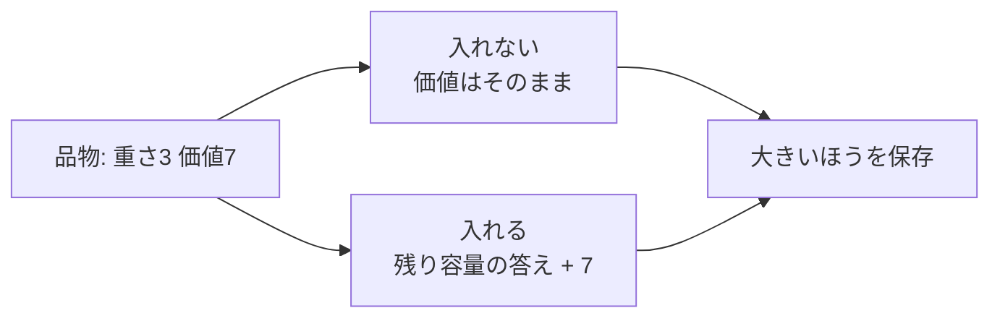

# 0-1ナップザック問題: カバンに入れる宝物を選ぼう

0-1ナップザック問題は、重さの制限があるカバンに、価値の高い品物をできるだけうまく入れる問題です。

各品物は「入れる」か「入れない」かのどちらかです。半分だけ入れることはできないので、0-1と呼ばれます。

## 使いどころ

- 限られた予算や容量で最大の成果を選ぶ問題
- 動的計画法の代表的な練習問題
- 「選ぶ・選ばない」の判断を表にして整理する問題

## 手順

1. `dp[w]` を「重さ `w` まで使えるときの最大価値」と考える
2. 品物を1つずつ見る
3. 入れられる重さなら、入れた場合と入れない場合を比べる
4. 大きい価値を保存する

## 図で見る



## コピペ用コード

```python
def knapsack(items, capacity):
    dp = [0] * (capacity + 1)

    for weight, value in items:
        for w in range(capacity, weight - 1, -1):
            dp[w] = max(dp[w], dp[w - weight] + value)

    return dp[capacity]


items = [(2, 3), (3, 4), (4, 5)]
print(knapsack(items, 5))
```

## コードの読み方

- `dp[w]` は、重さ `w` まで使えるときの最大価値です。
- `dp[w - weight] + value` は、その品物を入れた場合の価値です。
- `range(capacity, weight - 1, -1)` と逆順に見ることで、同じ品物を2回使わないようにしています。

## 計算量

品物の数を n、容量を W とすると **O(n × W)** です。品物100個・容量10,000でも100万回のループで済みます。「全部の組み合わせを試す」と 2^100 通りになるのと比べると、[動的計画法](/docs/algorithms/dynamic-programming/)の威力がよく分かります。

## 別パターン1: 2次元DPで表を目で見る

1次元版はコンパクトですが、初めて学ぶときは「品物×容量」の表を作る2次元版のほうが動きを追いやすいです。

```python
def knapsack_2d(items, capacity):
    n = len(items)
    # dp[i][w] = 品物 i 個目まで見て、容量 w のときの最大価値
    dp = [[0] * (capacity + 1) for _ in range(n + 1)]

    for i, (weight, value) in enumerate(items, 1):
        for w in range(capacity + 1):
            dp[i][w] = dp[i - 1][w]  # 入れない場合
            if w >= weight:
                dp[i][w] = max(dp[i][w], dp[i - 1][w - weight] + value)

    return dp

items = [(2, 3), (3, 4), (4, 5)]
dp = knapsack_2d(items, 5)

for i, row in enumerate(dp):
    print(f"品物{i}個目まで: {row}")
# 品物0個目まで: [0, 0, 0, 0, 0, 0]
# 品物1個目まで: [0, 0, 3, 3, 3, 3]
# 品物2個目まで: [0, 0, 3, 4, 4, 7]
# 品物3個目まで: [0, 0, 3, 4, 5, 7]

print(dp[3][5])  # 7
```

- `dp[i - 1][w]` は「i 個目を入れない」、`dp[i - 1][w - weight] + value` は「入れる」場合です。
- 1つ前の行（`i - 1`）だけを参照するので、行を1本にまとめたのが冒頭の1次元版です。逆順ループはその名残です。

## 別パターン2: どの品物を選んだか復元する

「最大価値7」だけでなく「何を入れたのか」を知りたい場合は、2次元の表を後ろからたどります。

```python
def knapsack_with_items(items, capacity):
    n = len(items)
    dp = [[0] * (capacity + 1) for _ in range(n + 1)]

    for i, (weight, value) in enumerate(items, 1):
        for w in range(capacity + 1):
            dp[i][w] = dp[i - 1][w]
            if w >= weight:
                dp[i][w] = max(dp[i][w], dp[i - 1][w - weight] + value)

    # 表を後ろからたどって選んだ品物を特定する
    chosen = []
    w = capacity
    for i in range(n, 0, -1):
        if dp[i][w] != dp[i - 1][w]:  # 値が変わった = i 個目を入れた
            weight, value = items[i - 1]
            chosen.append((weight, value))
            w -= weight

    chosen.reverse()
    return dp[n][capacity], chosen

items = [(2, 3), (3, 4), (4, 5)]
best, chosen = knapsack_with_items(items, 5)
print(best)    # 7
print(chosen)  # [(2, 3), (3, 4)] (重さ2と3を選んで価値7)
```

- `dp[i][w] != dp[i - 1][w]` なら「i 個目を入れたことで価値が上がった」＝選んだ品物です。
- 選んだら容量 `w` をその重さぶん戻して、さらに前を調べます。

## 個数制限なし（重複あり）ナップサックとの違い

「同じ品物を何個でも入れてよい」問題は、ループの向きを**昇順**に変えるだけで解けます。

```python
def knapsack_unbounded(items, capacity):
    dp = [0] * (capacity + 1)

    for weight, value in items:
        for w in range(weight, capacity + 1):  # 昇順!
            dp[w] = max(dp[w], dp[w - weight] + value)

    return dp[capacity]

items = [(2, 3), (3, 4), (4, 5)]
print(knapsack_unbounded(items, 5))  # 7 (重さ2を2個 + ... ではなく 2+3 が最適)
print(knapsack_unbounded([(2, 3)], 6))  # 9 (重さ2を3個)
```

- 昇順に更新すると「今の品物を入れた後の結果」をさらに使えるため、同じ品物を複数回入れられます。
- **0-1（1個まで）は降順、個数制限なしは昇順** —— この対比で逆順ループの意味が腑に落ちます。

## よくあるミス

| ミス | 何が起きるか | 対処 |
| :--- | :--- | :--- |
| 1次元DPで昇順に更新する | 同じ品物を複数回入れてしまう | 0-1なら必ず降順（`capacity` から `weight` まで） |
| `dp` のサイズを `capacity` にする | `dp[capacity]` が範囲外になる | `capacity + 1` で確保する |
| 重さと価値のタプルの順番を混同する | 答えが合わない | `(重さ, 価値)` の順をコメントで固定する |

## 注意点

逆順に更新するのが重要です。小さい重さから更新すると、同じ品物を何度も入れたことになってしまいます。

## AOJで挑戦してみよう！

<div className="aojChallenge">
  <p className="aojChallenge__message">学んだレシピを実際に使って、ジャッジから「Accepted（正解）」を勝ち取ろう！</p>
  <div className="aojChallenge__links">
    <a className="aojChallenge__button" href="https://judge.u-aizu.ac.jp/onlinejudge/description.jsp?id=DPL_1_B&lang=ja" target="_blank" rel="noopener noreferrer">
      <span className="aojChallenge__label">DPL_1_B: 0-1 Knapsack Problem</span>
      <span className="aojChallenge__icon" aria-hidden="true">↗</span>
    </a>
  </div>
</div>
