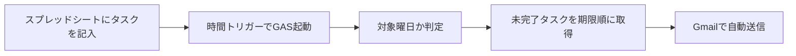
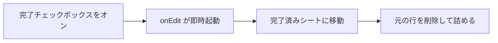

import ProductHero from '@site/src/components/ProductHero';
import TOCCollapsible from '@theme/TOCCollapsible';

# Task AutoMailer

<ProductHero
  links={[
    {href: 'https://docs.google.com/spreadsheets/d/1a-dqs06uuafCe2MHamkG9SxJfrTzZJSnW3UTi_eaitg/copy', label: 'スプレッドシート雛形をコピー', isPrimary: true},
    {href: '/files/task-automailer-gas.txt', label: 'GAS テンプレート（.txt）'},
  ]}>
  <p><strong>Task AutoMailer</strong> は、Google スプレッドシートで管理したタスクを、指定した曜日・時間に自動でメール送信する Google Apps Script（GAS）のテンプレートです。</p>
  <p>完了タスクはチェックひとつで別シートへ自動移動します。Google アカウントだけで完結し、追加アプリは不要です。</p>
  <p><strong>公開中</strong> · Google Apps Script · Google スプレッドシート · Gmail</p>
</ProductHero>

:::tip スプレッドシート雛形
**[Google スプレッドシートをコピー](https://docs.google.com/spreadsheets/d/1a-dqs06uuafCe2MHamkG9SxJfrTzZJSnW3UTi_eaitg/copy)**（3シート・チェックボックス付き）→ 自分のドライブに複製してから、下のセットアップ手順に進みます。
:::

<TOCCollapsible toc={toc} />

## このツールについて

| 項目 | 内容 |
| :--- | :--- |
| 名称 | Task AutoMailer |
| 使用技術 | Google Apps Script / Google スプレッドシート / Gmail |
| 対象 | タスクを自分の会社メールに定期送信したい方 |
| 形式 | Google Apps Script（ブラウザ上で設定・動作） |
| 送信曜日 | 月～日（`TARGET_DAYS` で変更可） |
| 送信時間 | 時間トリガーで自由に設定（例：午前11時台） |
| 送信先 | 指定のメールアドレス |

Google スプレッドシートにタスク・期限・重要度を記入するだけで、設定した曜日・時間に未完了タスクの一覧をメールへ自動送信します。

完了したタスクはチェックボックスをオンにするだけで「完了済み」シートへ自動的に移動し、行が上に詰まります。わざわざ手動で管理し直す手間がありません。

## 使用技術

Task AutoMailer は、Google Workspace の標準機能を組み合わせて作った業務自動化ツールです。新しいWebサーバーや専用アプリを用意せず、Google アカウントだけで「データ管理」「自動処理」「メール送信」まで実現しています。

### 処理を動かす技術

| 技術 | このツールでの役割 |
| :--- | :--- |
| Google Apps Script | スプレッドシートの読み取り、完了移動、メール送信、時間トリガーを動かす |
| JavaScriptに近い構文 | 変数、配列、条件分岐、関数を使って自動化処理を書く |
| 時間主導型トリガー | 指定した曜日・時間に `sendTaskEmail` を自動実行する |
| `onEdit` トリガー | チェックボックス操作に反応して完了タスクを自動移動する |

### データを管理する技術

| 技術 | このツールでの役割 |
| :--- | :--- |
| Google スプレッドシート | タスク、期限、重要度、完了状態を表形式で管理する |
| チェックボックス | 完了操作を分かりやすくする |
| 複数シート | 未完了タスクと完了済みタスクを分けて管理する |
| 日付データ | 期限順ソートやメール本文の日付表示に使う |

### 通知・運用に使うサービス

| サービス | このツールでの役割 |
| :--- | :--- |
| Gmail | 未完了タスク一覧を指定メールアドレスへ送信する |
| Google Drive | コピーしたスプレッドシートとGASプロジェクトを保存する |
| Google Workspace | 会社や学校のアカウント範囲で運用しやすくする |

## 業務自動化の実用例として見る

このツールは、「毎回手で確認していた作業」をGoogle Apps Scriptで自動化する実例です。

| 観点 | 学べる考え方 |
| :--- | :--- |
| データ管理 | スプレッドシートを簡易データベースのように使う |
| 条件分岐 | 対象曜日・対象時間だけメールを送る |
| 並び替え | 期限と重要度をもとに優先順位を決める |
| イベント処理 | チェックボックスの編集をきっかけに処理を動かす |
| 自動通知 | 必要な情報を決まったタイミングでメール送信する |

この考え方は、提出物リマインド、日報通知、在庫チェック、面談予定の通知、問い合わせ管理などにも応用できます。

## できること

| 機能 | 説明 |
| :--- | :--- |
| 自動メール送信 | 指定曜日・指定時間に未完了タスクを自動送信 |
| 期限順ソート | 期限が近い順に並べ替え、同一期限内は重要度順 |
| 重要度の色分け | 高・中・低でメール本文に記号表示（★★★ など） |
| 完了タスクの自動移動 | チェックで完了済みシートへ移動し行を詰める |
| スプレッドシート管理 | タスク・期限・重要度・完了の4列で直感的に管理 |
| 追加アプリ不要 | Google アカウントだけで完結。外部サービス不要 |

## 仕組み・フロー

### メール送信フロー



### 完了タスクの移動フロー



### スプレッドシートの構成

タスク一覧シートは次の4列で管理します。

| 列 | 内容 |
| :--- | :--- |
| A列：タスク | タスクの内容（メール本文で太字表示） |
| B列：期限 | 日付形式で入力（表示は `yyyy年mm月dd日（曜日）`） |
| C列：重要度 | 高 / 中 / 低 のいずれか |
| D列：完了 | チェックボックス（オンで完了済みシートへ移動） |

## スプレッドシートの画面

実際のスプレッドシートは、タスク一覧・完了済み・数値管理の3シートで構成します。

<div class="task-automailer-gallery">

<figure class="task-automailer-shot">

<figcaption>タスク一覧シート — タスク・期限・重要度・完了チェックで未完了タスクを管理</figcaption>
</figure>

<figure class="task-automailer-shot">

<figcaption>完了済みシート — チェックしたタスクが自動で移動し、完了日が記録される</figcaption>
</figure>

<figure class="task-automailer-shot">

<figcaption>数値管理シート — タスク件数などの集計・参照用</figcaption>
</figure>

</div>

## 送信メールの画面

指定曜日・指定時間に、未完了タスク一覧がメールで届きます（曜日は `TARGET_DAYS`、時刻は時間トリガーで設定）。

<div class="task-automailer-gallery task-automailer-gallery--email">

<figure class="task-automailer-shot task-automailer-shot--inbox">

<figcaption>受信画面 — 件名に日付付きで「本日のタスク一覧」が届く</figcaption>
</figure>

<figure class="task-automailer-shot">

<figcaption>メール本文 — タスク名・重要度（★）・期限が期限順に並ぶ</figcaption>
</figure>

</div>

## セットアップ手順

1. **[スプレッドシート雛形をコピー](https://docs.google.com/spreadsheets/d/1a-dqs06uuafCe2MHamkG9SxJfrTzZJSnW3UTi_eaitg/copy)** — Google アカウントでログインし、「コピーを作成」で自分のドライブに複製します（3シート・チェックボックス付き）。
2. **スプレッドシートのIDを控える** — コピー後の URL の `/d/【ここ】/edit` がIDです。GAS の `SPREADSHEET_ID` は **コピー先のID** に書き換えてください。
3. **Apps Script を開く** — コピーしたスプレッドシートのメニュー →「拡張機能」→「Apps Script」。
4. **設定を編集する** — `SPREADSHEET_ID`・`SEND_TO`・`SEND_HOUR`・`TARGET_DAYS` を自分の環境に合わせて変更。スクリプトが空の場合は [GAS テンプレート（.txt）](/files/task-automailer-gas.txt) を貼り付けます。
5. **時間トリガーを設定する** — 左メニューの時計マーク →「トリガーを追加」→ 関数 `sendTaskEmail`、時間主導型、日付ベース。**`SEND_HOUR` に合わせた時間帯**を選びます（例：`SEND_HOUR = 11` →「午前11〜12時」）。
6. **権限を許可する** — 初回実行時に Google の権限確認で「許可」を押します。

## こんな人におすすめ

- 毎朝タスクを会社メールに送って一日を整理したい人
- タスク管理アプリを増やさず、スプレッドシートで完結させたい人
- 完了タスクを自動で整理し、常にクリーンなリストを保ちたい人
- 期限・重要度でタスクを優先順位付けして把握したい人
- Google Workspace（会社アカウント）の範囲内で完結したい人

## Code Recipe とのつながり

Task AutoMailer は、プログラミングを「画面を作る」だけでなく、「日々の作業を自動化する」ために使う例です。Google Apps Script は JavaScript に近い構文で書けるため、JavaScript の基本を学んだあとに業務自動化へ広げる題材としても向いています。

- [JavaScript](/docs/development/languages/javascript/) — 条件分岐、配列、関数、日付処理の基礎
- [SQL](/docs/development/languages/sql/) — 表形式データを扱う考え方を学びたいとき
- [技術選定ガイド](/docs/development/technology-selection/) — なぜ専用サーバーではなくGASを選ぶのか考えたいとき
- [開発用語集](/docs/development/glossary/) — トリガー、API、データベースなどの言葉を確認したいとき

## 公開状況

| 項目 | 状態 |
| :--- | :--- |
| GASスクリプト | 完成・稼働中 |
| 自動メール送信 | 動作確認済み |
| 完了タスク自動移動 | 動作確認済み |
| HTMLメール（色付き） | 開発中 |

## ダウンロード

| 種類 | リンク |
| :--- | :--- |
| スプレッドシート雛形 | [Google スプレッドシートをコピー](https://docs.google.com/spreadsheets/d/1a-dqs06uuafCe2MHamkG9SxJfrTzZJSnW3UTi_eaitg/copy) |
| GAS スクリプト | [task-automailer-gas.txt](/files/task-automailer-gas.txt) |

## コードの解説

テンプレートは **設定 → ユーティリティ → 完了移動 → メール送信** の4ブロックに分かれています。まず各関数の役割を把握し、全文が必要なときは下の折りたたみから確認してください。

### 全体の構成

| ブロック | 内容 |
| :--- | :--- |
| 設定エリア | スプレッドシート ID・送信先・曜日・時刻など、環境ごとに変える定数 |
| ユーティリティ | 日付の表示形式を整える補助関数 |
| `onEdit` | 完了チェック時に行を別シートへ移動（編集トリガー・自動起動） |
| `sendTaskEmail` | 時間トリガーから呼ばれ、未完了タスクをメール送信 |

### 設定エリア（定数）

| 定数 | 役割 | ポイント |
| :--- | :--- | :--- |
| `SPREADSHEET_ID` | タスク一覧のスプレッドシートを指定 | 雛形をコピーした**後**の URL から取得。Apps Script を開いているシートと別でも、この ID のシートを読みにいく |
| `SHEET_NAME` | 未完了タスクのシート名 | `onEdit` と `sendTaskEmail` の両方で同じ名前を参照。雛形は「タスク一覧」 |
| `DONE_SHEET_NAME` | 完了タスクの移動先 | シートが無ければ自動作成される |
| `SEND_TO` | メールの送信先 | GAS を実行する Google アカウントから送るため、送信権限の許可が必要 |
| `SEND_HOUR` | 送信する「時」（0〜23） | トリガーの時間帯と**必ず一致**させる。コード内でも同じ時だけ送信し、誤送信を防ぐ |
| `TARGET_DAYS` | 送信する曜日の配列 | `0`（日）〜 `6`（土）。送りたい曜日だけ残し、他は行頭の `//` で無効化 |
| `SEND_IF_EMPTY` | 未完了 0 件でも送るか | `false` なら件数 0 のとき送信せず終了。「今日はタスクなし」の通知が欲しいときは `true` |

### `formatDate(value)`

| 項目 | 内容 |
| :--- | :--- |
| 役割 | セルの期限をメール本文用の `yyyy年mm月dd日（曜日）` 形式に変換する |
| ポイント | 空セルは「期限なし」。日付として解釈できない文字はそのまま返すため、入力ミスでも処理が止まらない |

### `getTodayString()`

| 項目 | 内容 |
| :--- | :--- |
| 役割 | 件名・本文冒頭用に、今日を `m月d日（曜日）` の短い形式で返す |
| ポイント | `formatDate` とは用途が異なる。件名を短く見せるための専用フォーマット |

### `onEdit(e)`

| 項目 | 内容 |
| :--- | :--- |
| 役割 | D 列のチェックをオンにした行を「完了済み」シートへ移し、元の行を削除する |
| ポイント | **トリガー設定は不要**（スプレッドシートの簡易トリガー）。`TRUE` にしたときだけ動作し、チェックを外す操作は無視する。対象はタスク一覧シート・D 列・2 行目以降のみ。完了日を 5 列目に追加してから追記する |

### `sendTaskEmail()`

| 項目 | 内容 |
| :--- | :--- |
| 役割 | 時間トリガーから呼ばれるメイン処理。未完了タスクを取得・整列して Gmail で送信する |
| ポイント | 冒頭で曜日（`TARGET_DAYS`）と時刻（`SEND_HOUR`）を確認し、条件外なら即終了。トリガーが毎日動いても送信は意図した曜日・時刻だけ。未完了は「D 列が true でない」「A 列が空でない」行。期限昇順、同期限は重要度（高→中→低）。`SPREADSHEET_ID` で開くため、バインド先と ID が違っていても動く |

## GAS テンプレート（ページ内コピー用）

下記は [task-automailer-gas.txt](/files/task-automailer-gas.txt) と同じ内容です。長いため折りたたみにしています。

<details class="gas-code-details">
<summary>GAS コード全文を表示（クリックで開く）</summary>

```javascript
/**
 * ============================================================
 *  Task AutoMailer — テンプレート
 *  Google スプレッドシートのタスクを指定曜日に自動メール送信
 *  完了チェックで別シートへ自動移動
 * ============================================================
 *
 * 【スプレッドシートの列構成】
 *   A列：タスク名
 *   B列：期限（日付形式）
 *   C列：重要度（高 / 中 / 低）
 *   D列：完了（チェックボックス）
 *
 * 【セットアップ手順】
 *   1. 下記「設定エリア」を自分の環境に合わせて編集する
 *   2. Apps Script の「サービス」から Tasks API は不要
 *   3. 左メニューの時計マーク →「トリガーを追加」
 *      関数：sendTaskEmail / 時間主導型 / 日付ベース
 *      時刻：SEND_HOUR で設定した時間帯を選択
 *            例）SEND_HOUR = 11 → トリガーは「午前11〜12時」を選択
 *   4. 初回実行時に権限を許可する
 * ============================================================
 */


// ============================================================
//  ★ 設定エリア（ここだけ編集してください）
// ============================================================

/** スプレッドシートのID（URLの /d/【ここ】/edit） */
const SPREADSHEET_ID = "スプレッドシートのIDを入力";

/** タスクを管理しているシート名 */
const SHEET_NAME = "タスク一覧";

/** 完了タスクの移動先シート名（存在しない場合は自動作成） */
const DONE_SHEET_NAME = "完了済み";

/** 送信先メールアドレス */
const SEND_TO = "送信先のメールアドレスを入力";

/**
 * メールを送信する時間帯（0〜23 で指定）
 * ※ GASのトリガー設定と必ず合わせてください
 *
 * 例）
 *   SEND_HOUR = 8  → 午前8時台に送信  → トリガーは「午前8〜9時」
 *   SEND_HOUR = 11 → 午前11時台に送信 → トリガーは「午前11〜12時」
 *   SEND_HOUR = 17 → 午後5時台に送信  → トリガーは「午後5〜6時」
 */
const SEND_HOUR = 11;

/**
 * メールを送信する曜日（送りたい曜日の行頭の // を削除してください）
 *
 * 0 = 日曜日
 * 1 = 月曜日
 * 2 = 火曜日
 * 3 = 水曜日
 * 4 = 木曜日
 * 5 = 金曜日
 * 6 = 土曜日
 */
const TARGET_DAYS = [
  0, // 日
  1, // 月
  2, // 火
  3, // 水
  4, // 木
  5, // 金
  6, // 土
];

/**
 * 未完了タスクが0件のときもメールを送るか
 * true = 送る / false = 送らない（スキップ）
 */
const SEND_IF_EMPTY = false;

// ============================================================
//  ユーティリティ
// ============================================================

/**
 * 日付値を "yyyy年mm月dd日（曜日）" 形式に変換する
 * @param {*} value - セルの値（Date / 文字列 / 空）
 * @returns {string}
 */
function formatDate(value) {
  if (!value) return "期限なし";
  const d = new Date(value);
  if (isNaN(d.getTime())) return String(value);
  const weekdays = ["日", "月", "火", "水", "木", "金", "土"];
  const y   = d.getFullYear();
  const m   = String(d.getMonth() + 1).padStart(2, "0");
  const day = String(d.getDate()).padStart(2, "0");
  const w   = weekdays[d.getDay()];
  return `${y}年${m}月${day}日（${w}）`;
}

/**
 * 今日の日付を "m月d日（曜日）" 形式で返す
 * @returns {string}
 */
function getTodayString() {
  const today    = new Date();
  const weekdays = ["日", "月", "火", "水", "木", "金", "土"];
  const month    = today.getMonth() + 1;
  const date     = today.getDate();
  const dayName  = weekdays[today.getDay()];
  return `${month}月${date}日（${dayName}）`;
}

// ============================================================
//  ① 完了チェックで別シートへ自動移動（onEdit トリガー）
// ============================================================

/**
 * チェックボックス（D列）をオンにすると
 * その行を完了済みシートへ移動し、元の行を削除する
 *
 * ※ このトリガーは手動設定不要。スプレッドシートの編集時に自動起動します。
 */
function onEdit(e) {
  const sheet = e.source.getActiveSheet();

  // タスク一覧シート以外・D列以外・ヘッダー行は無視
  if (sheet.getName() !== SHEET_NAME) return;
  if (e.range.getColumn() !== 4)      return;
  if (e.range.getRow()    === 1)      return;
  if (e.value             !== "TRUE") return;

  const row       = e.range.getRow();
  const ss        = e.source;
  const doneSheet = ss.getSheetByName(DONE_SHEET_NAME) || ss.insertSheet(DONE_SHEET_NAME);

  // 行データを取得し、完了日を末尾に追加して移動先へ追記
  const rowData     = sheet.getRange(row, 1, 1, 4).getValues()[0];
  const completedAt = Utilities.formatDate(new Date(), "Asia/Tokyo", "yyyy/MM/dd");
  rowData.push(completedAt);
  doneSheet.appendRow(rowData);

  // 元の行を削除（上に詰める）
  sheet.deleteRow(row);
}

// ============================================================
//  ② 指定曜日・指定時間にメール自動送信
// ============================================================

/**
 * 時間トリガーから呼ばれるメイン関数
 * TARGET_DAYS 以外の曜日・SEND_HOUR 以外の時間帯は何もしない
 */
function sendTaskEmail() {
  const today     = new Date();
  const dayOfWeek = today.getDay();
  const hour      = today.getHours();

  // 対象曜日・対象時間帯でなければ終了
  if (!TARGET_DAYS.includes(dayOfWeek)) return;
  if (hour !== SEND_HOUR)               return;

  // スプレッドシートからデータ取得
  const ss    = SpreadsheetApp.openById(SPREADSHEET_ID);
  const sheet = ss.getSheetByName(SHEET_NAME);
  const data  = sheet.getDataRange().getValues();

  // 1行目（ヘッダー）を除いた未完了タスクのみ抽出
  const tasks = data.slice(1).filter(row => row[3] !== true && row[0] !== "");

  // タスクが0件のとき
  if (tasks.length === 0) {
    Logger.log("未完了タスクがありません");
    if (!SEND_IF_EMPTY) return;
  }

  // 期限の昇順でソート（期限なしは末尾）
  // 期限が同じ場合は重要度順（高→中→低）
  const importanceOrder = { "高": 0, "中": 1, "低": 2 };
  tasks.sort((a, b) => {
    const dA = a[1] ? new Date(a[1]).getTime() : Infinity;
    const dB = b[1] ? new Date(b[1]).getTime() : Infinity;
    if (dA !== dB) return dA - dB;
    return (importanceOrder[a[2]] ?? 9) - (importanceOrder[b[2]] ?? 9);
  });

  // メール本文を組み立て
  const dateStr        = getTodayString();
  const importanceMark = { "高": "★★★", "中": "★★☆", "低": "★☆☆" };

  let body = `${dateStr} 本日のタスク一覧です。ご確認よろしくお願いいたします。\n`;
  body    += "=".repeat(40) + "\n\n";

  if (tasks.length === 0) {
    body += "本日の未完了タスクはありません。\n\n";
  } else {
    for (const task of tasks) {
      const title      = task[0] || "";
      const deadline   = formatDate(task[1]);
      const importance = task[2] || "－";
      const mark       = importanceMark[importance] || "　";
      body += `【${title}】　重要度：${importance}（${mark}）\n`;
      body += `　　期限：${deadline}\n\n`;
    }
  }

  body += "=".repeat(40) + "\n";
  body += "※ このメールは自動送信されています。";

  // 送信
  const subject = `${dateStr} 本日のタスク一覧`;
  GmailApp.sendEmail(SEND_TO, subject, body);
  Logger.log(`送信完了：${subject}（${tasks.length}件）`);
}
```

</details>

## 関連リンク

- [スプレッドシート雛形をコピー](https://docs.google.com/spreadsheets/d/1a-dqs06uuafCe2MHamkG9SxJfrTzZJSnW3UTi_eaitg/copy)
- [GAS テンプレート（.txt）](/files/task-automailer-gas.txt)
- [開発実例一覧](/docs/apps/)
- [運営者情報](/operator/) — 開発者の経歴・他の自動化ツール
