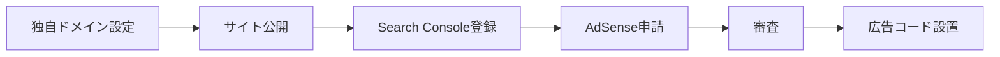

# Google AdSense の設定と収益化

サイトを公開したあと、**Google AdSense** を使うと広告を表示して収益を得ることができます。

このページでは、**独自ドメインを取得済み** で、GitHub Pages などにサイトを公開している前提で、Search Console 登録から AdSense 申請・審査対策・広告の設置までをまとめます。

## 全体の流れ



1. 独自ドメインをサイトに紐付ける（おさらい）
2. サイトを安定して公開する
3. **Google Search Console** にサイトを登録・確認する
4. **Google AdSense** に申請する
5. 審査に通るようサイトを整える
6. 合格後、広告コードをサイトに設置する

:::tip 先に用意しておきたいページ
AdSense の審査では、サイトの信頼性が問われます。最低限、次のページがあると安心です。

- [プライバシーポリシー](/privacy-policy)
- [お問い合わせ](/contact)
- [運営者情報](/operator)
:::

## 1. 独自ドメインをサイトに設定する（おさらい）

独自ドメインは **取得済み** を前提とします。ここでは、公開サイトの URL を独自ドメインにそろえる作業のおさらいです。

### GitHub Pages で独自ドメインを使う場合

1. ドメイン管理画面で DNS を設定する
   - ルートドメイン（`example.com`）: 多くの場合 **A レコード** またはレジストラの案内に従う
   - サブドメイン（`www.example.com`）: **CNAME** で `ユーザー名.github.io` などを指定
2. GitHub リポジトリの **Settings → Pages** で `Custom domain` にドメインを入力
3. `Enforce HTTPS` を有効にする
4. ブラウザで `https://あなたのドメイン/` が開けることを確認する

```text
例:
https://code-recipe.example.com/
```

DNS の反映には数分〜最大48時間かかることがあります。

## 2. Google Search Console に登録する

Search Console は、Google に「このサイトは自分のものです」と伝え、検索結果への登録状況を確認するためのツールです。**AdSense 申請の前に登録する**のがおすすめです。

### 2-1. アカウントを用意する

1. [Google Search Console](https://search.google.com/search-console/) にアクセスする
2. Google アカウントでログインする（AdSense と同じアカウントを使うと後が楽）

### 2-2. プロパティ（サイト）を追加する

「プロパティを追加」から、次のいずれかを選びます。

| 方式 | 向いているケース |
| :--- | :--- |
| **ドメイン** | `example.com` 全体（サブドメイン含む）をまとめて管理したい |
| **URL プレフィックス** | `https://example.com/` など、特定の URL で管理したい |

初学者は、実際に公開している URL に合わせて **URL プレフィックス** を選ぶと分かりやすいです。

### 2-3. 所有者確認（サイトの確認）

Google が提示する方法のいずれかで確認します。

| 方法 | 概要 |
| :--- | :--- |
| **HTML ファイル** | 指定ファイルをサイトのルートに置く |
| **HTML タグ** | サイトの `<head>` にメタタグを入れる |
| **DNS レコード** | ドメインに TXT レコードを追加する |

GitHub Pages + Docusaurus の場合の例:

- **HTML ファイル方式:** `static/` フォルダに確認用ファイルを置き、push して公開する
- **DNS 方式:** ドメイン管理画面に TXT レコードを追加する（独自ドメイン利用時に便利）

「確認」が成功すると、Search Console でデータが見える状態になります。

### 2-4. サイトマップを送信する

サイトマップを送ると、Google がページを見つけやすくなります。

1. Search Console の「サイトマップ」を開く
2. サイトマップ URL を入力して送信する

Docusaurus では、ビルド後に `sitemap.xml` が生成されます。

```text
例（独自ドメインがルートの場合）:
https://あなたのドメイン/sitemap.xml

例（GitHub Pages のプロジェクトサイトの場合）:
https://ユーザー名.github.io/リポジトリ名/sitemap.xml
```

## 3. Google AdSense に登録・申請する

### 3-1. AdSense アカウントを作る

1. [Google AdSense](https://www.google.com/adsense/) にアクセスする
2. Google アカウントでログインする
3. 国・地域、利用規約に同意してアカウントを作成する

### 3-2. サイトを追加して申請する

1. AdSense 管理画面で「サイトを追加」
2. 公開中の URL を入力する（Search Console と **同じ URL** にそろえる）
3. 支払い先情報・本人確認など、画面の案内に従って入力する
4. Search Console と連携できる場合は、連携しておく

### 3-3. 審査を待つ

申請後、**数日〜数週間** で審査結果が届きます。すぐに合格しないことも珍しくありません。

メールと AdSense 管理画面で状態を確認します。

- **審査中:** そのまま待つ。サイトは公開し続ける
- **要修正:** 指摘内容を直して再申請
- **合格:** 広告コードの取得・設置へ進む

## 4. 審査に通るためのポイント

AdSense は「広告を出しても品質を保てるサイトか」を審査します。次を意識しましょう。

### コンテンツ

- **オリジナルの文章** が中心である（コピペだけのサイトは不利）
- ページ数が極端に少ない（1ページだけ）状態を避ける
- 学習者にとって **役立つ内容** が続いている

### サイトの体裁

- トップ・各ページが **普通に閲覧できる**（404 や真っ白のページがない）
- **HTTPS** で公開されている
- メニューやフッターから主要ページへ移動できる
- [プライバシーポリシー](/privacy-policy) に **広告・Cookie** の記載がある
- [お問い合わせ](/contact) や [運営者情報](/operator) がある

### ポリシー面

- 著作権を侵害するコンテンツを載せない
- クリックを煽る表示（「ここを押して」など）をしない
- **自分の広告を自分でクリックしない**（アカウント停止の原因になる）

### 運用のコツ

- 申請前に、最低 **10〜15ページ程度** の有用な記事があると安心
- 公開直後すぐより、**数週間〜数ヶ月** 運用してから申請する例も多い
- Search Console でエラーが出ていないか確認する

## 5. 審査合格後：広告をサイトに設置する

審査に通ったら、AdSense 管理画面から広告コードを取得し、サイトに埋め込みます。

### 5-1. 広告の種類を選ぶ

| 種類 | 説明 |
| :--- | :--- |
| **自動広告** | Google がページに合わせて広告位置を決める（設定が簡単） |
| **広告ユニット** | 表示したい場所に個別のコードを置く |

最初は **自動広告** から試す人が多いです。

### 5-2. Docusaurus（Code Recipe）への設置例

`docusaurus.config.ts` の `scripts` に、AdSense からコピーしたコードを追加する方法があります。

```ts
// docusaurus.config.ts の themeConfig など、scripts 配列に追加
scripts: [
  {
    src: 'https://pagead2.googlesyndication.com/pagead/js/adsbygoogle.js?client=ca-pub-XXXXXXXX',
    async: true,
    crossorigin: 'anonymous',
  },
],
```

`ca-pub-XXXXXXXX` は **自分の AdSense 発行 ID** に置き換えます。他人の ID は使えません。

変更後は `git push` して GitHub Actions のデプロイが完了したら、本番サイトで表示を確認します。

### 5-3. 表示確認の注意

- 自分のサイトでは、しばらく **テスト広告** や空白に見えることがある
- 広告ブロック拡張をオフにして確認する
- 本番反映後、数時間かかることもある

## 6. 収益化で覚えておきたいこと

- 収益は **クリック数・表示回数** などに応じて変動する
- 支払いには **支払い先の設定** と **本人確認** が必要
- 一定額に達するまで振込されない（国・設定により異なる）
- サイトの内容やアクセス数が増えると、収益も変わる

学習サイトの場合、まずは「審査に通して広告を正しく表示できる状態を作る」ことを目標にするとよいです。

## チェックリスト

申請前に、次を一度確認しましょう。

- [ ] 独自ドメインで `https://` 公開されている
- [ ] Search Console で所有者確認が完了している
- [ ] サイトマップを送信した
- [ ] プライバシーポリシー・お問い合わせ・運営者情報がある
- [ ] 主要ページがリンク切れなく表示できる
- [ ] オリジナルの学習コンテンツが複数ページある
- [ ] AdSense に正しい URL で申請した

## 関連リンク

- [Google AdSense](https://www.google.com/adsense/)
- [Google Search Console](https://search.google.com/search-console/)
- [Google の広告ポリシーと規約](https://policies.google.com/technologies/ads?hl=ja)
- [Code Recipe プライバシーポリシー](/privacy-policy)
- [プロジェクト立ち上げとトークン発行](./project-setup-and-token) — GitHub 公開の基本
