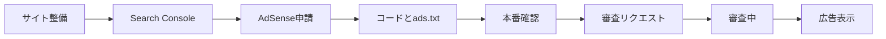

# Google AdSense の設定と収益化

サイトを公開したあと、**Google AdSense** を使うと広告を表示して収益を得ることができます。

このページでは、**独自ドメインを取得済み** で、GitHub Pages などにサイトを公開している前提で、Search Console 登録から AdSense 申請・審査対策・広告の設置までをまとめます。

## 全体の流れ



1. 独自ドメイン・固定ページ・コンテンツを整える
2. **Google Search Console** に登録（サイトマップ・`robots.txt`・インデックス登録）
3. **Google AdSense** にサイトを追加する
4. **審査用コード** を `docusaurus.config.ts` に埋め込む
5. **`static/ads.txt`** と **`static/robots.txt`** を公開する
6. **本番反映後の確認** を行う
7. AdSense 画面から **審査をリクエスト** する
8. 合格後、管理画面で自動広告などを有効にする

:::tip 先に用意しておきたいページ
AdSense の審査では、サイトの信頼性が問われます。最低限、次のページがあると安心です。フッターなどからアクセスできるようにします。

| ページ | Code Recipe の例 |
| :--- | :--- |
| トップページ | サイトの入口 |
| このサイトについて | [運営者情報](/operator)（サイト概要・運営目的） |
| プライバシーポリシー | [プライバシーポリシー](/privacy-policy)（**広告・Cookie** の記載を含む） |
| お問い合わせ | [お問い合わせ](/contact)（GitHub Issues や Google フォームなど） |
| 利用規約・免責事項 | [利用規約・免責事項](/terms) |

お問い合わせは **リンクを押すと実際に連絡できる** 状態にしてください（フォームが開かない、404 になるなどは避ける）。
:::

## 1. 独自ドメインをサイトに設定する（おさらい）

独自ドメインは **取得済み** を前提とします。ここでは、公開サイトの URL を独自ドメインにそろえる作業のおさらいです。

### GitHub Pages で独自ドメインを使う場合

1. ドメイン管理画面で DNS を設定する
   - ルートドメイン（`example.com`）: 多くの場合 **A レコード** またはレジストラの案内に従う
   - サブドメイン（`www.example.com`）: **CNAME** で `ユーザー名.github.io` などを指定
2. GitHub リポジトリの **Settings → Pages** で `Custom domain` にドメインを入力
3. `Enforce HTTPS` を有効にする
4. ブラウザで `https://あなたのドメイン/` が開けることを確認する

```text
例:
https://code-recipe.example.com/
```

DNS の反映には数分〜最大48時間かかることがあります。

## 2. Google Search Console に登録する

Search Console は、Google に「このサイトは自分のものです」と伝え、検索結果への登録状況を確認するためのツールです。**AdSense 申請の前に登録する**のがおすすめです。

### 2-1. アカウントを用意する

1. [Google Search Console](https://search.google.com/search-console/) にアクセスする
2. Google アカウントでログインする（AdSense と同じアカウントを使うと後が楽）

### 2-2. プロパティ（サイト）を追加する

「プロパティを追加」から、次のいずれかを選びます。

| 方式 | 向いているケース |
| :--- | :--- |
| **ドメイン** | `example.com` 全体（サブドメイン含む）をまとめて管理したい |
| **URL プレフィックス** | `https://example.com/` など、特定の URL で管理したい |

**独自ドメインで運用する場合は、ドメイン プロパティがおすすめ** です。`www` と裸ドメインをまとめて管理でき、所有者確認は **DNS の TXT レコード** で行うことが多いです。

GitHub Pages のプロジェクト URL（`https://ユーザー名.github.io/リポジトリ名/`）だけで始める場合は、**URL プレフィックス** を選び、実際に公開している URL と一致させます。

:::caution プロパティの混同に注意
Search Console の **ドメイン プロパティ** と **URL プレフィックス** は別物です。AdSense に登録する URL と、Search Console で確認したプロパティの範囲が食い違うと、サイトマップやインデックスの確認がうまくいかないことがあります。**AdSense・Search Console・実際の公開 URL を同じ形にそろえる** ことを意識してください。
:::

### 2-3. 所有者確認（サイトの確認）

Google が提示する方法のいずれかで確認します。

| 方法 | 概要 |
| :--- | :--- |
| **HTML ファイル** | 指定ファイルをサイトのルートに置く |
| **HTML タグ** | サイトの `<head>` にメタタグを入れる |
| **DNS レコード** | ドメインに TXT レコードを追加する |

GitHub Pages + Docusaurus の場合の例:

- **HTML ファイル方式:** `static/` フォルダに確認用ファイルを置き、push して公開する
- **DNS 方式:** ドメイン管理画面に TXT レコードを追加する（独自ドメイン利用時に便利）

「確認」が成功すると、Search Console でデータが見える状態になります。

### 2-4. サイトマップを送信する

サイトマップを送ると、Google がページを見つけやすくなります。

1. Search Console の「サイトマップ」を開く
2. サイトマップ URL を入力して送信する

Docusaurus では、ビルド後に `sitemap.xml` が生成されます。

```text
例（独自ドメインがルートの場合）:
https://あなたのドメイン/sitemap.xml

例（GitHub Pages のプロジェクトサイトの場合）:
https://ユーザー名.github.io/リポジトリ名/sitemap.xml
```

### 2-5. robots.txt を用意する

`robots.txt` は、検索エンジン向けのルールファイルです。**クロールを拒否していないこと** と、**サイトマップの場所を示すこと** が審査前の確認ポイントになります。

#### 中身の例（独自ドメインがルートの場合）

```text
User-agent: *
Allow: /

Sitemap: https://example.com/sitemap.xml
```

| 行 | 意味 |
| :--- | :--- |
| `User-agent: *` | すべてのクローラー向け |
| `Allow: /` | サイト全体のクロールを許可 |
| `Sitemap:` | サイトマップの URL（**実際の公開 URL に合わせる**） |

#### Code Recipe での置き場所

Docusaurus では **`static/robots.txt`** に置きます（`ads.txt` と同じ考え方）。

```text
CodeRecipe/
  static/
    robots.txt       ← ここに作成
    ads.txt
```

GitHub Pages プロジェクトサイトの例:

```text
User-agent: *
Allow: /

Sitemap: https://k5fujiwara.github.io/code-recipe/sitemap.xml
```

独自ドメインに切り替えたら、`Sitemap:` の URL も **新しいドメインに更新** してください。

公開後はブラウザで `https://（あなたのサイト）/robots.txt` を開き、内容が表示されることを確認します。

### 2-6. URL 検査とインデックス登録リクエスト（任意だが推奨）

サイトマップを送ったあと、Search Console の **URL 検査** から主要ページのインデックス登録をリクエストすると、Google がページを見つけやすくなります。AdSense 審査の **必須手順ではありません** が、ほぼ入れておく人が多いです。

1. Search Console で対象プロパティを開く
2. 上部の URL 検査欄に、確認したい URL を入力する
   - 例: トップページ、プライバシーポリシー、お問い合わせ
3. 「URL が Google に登録されているか」を確認する
4. 未登録の場合、「インデックス登録をリクエスト」を押す

審査前にリクエストしておきたい URL の例:

- トップページ
- プライバシーポリシー
- お問い合わせ
- 運営者情報（このサイトについて）
- 利用規約・免責事項

## 3. Google AdSense に登録・申請する

### 3-1. AdSense アカウントを作る

1. [Google AdSense](https://www.google.com/adsense/) にアクセスする
2. Google アカウントでログインする
3. 国・地域、利用規約に同意してアカウントを作成する

### 3-2. サイトを追加して申請する

1. AdSense 管理画面で「サイトを追加」
2. 公開中の URL を入力する（Search Console と **同じ URL** にそろえる）
3. 支払い先情報・本人確認など、画面の案内に従って入力する
4. Search Console と連携できる場合は、連携しておく
5. 画面に表示される **審査用コード** をサイトに埋め込む（次の 3-3）
6. **ads.txt** を公開する（次の 3-4）

### 3-3. 審査用コードをサイトに埋め込む

AdSense の申請画面では、サイトに **AdSense コード**（審査用の広告スクリプト）を入れるよう案内されます。これは「このサイトは AdSense 申請者のものです」と Google に伝えるためのタグで、**審査中・合格後ともに全ページの `<head>` に置く**のが一般的です。

#### 審査用コードとは何か

AdSense 管理画面に表示されるコードは、だいたい次のような **1 行の `<script>`** です。

```html
<script async src="https://pagead2.googlesyndication.com/pagead/js/adsbygoogle.js?client=ca-pub-1234567890123456" crossorigin="anonymous"></script>
```

| 部分 | 意味 |
| :--- | :--- |
| `ca-pub-1234567890123456` | あなたの **パブリッシャー ID**（AdSense アカウントごとに 1 つ） |
| `async` | ページ表示を遅らせないよう、非同期で読み込む |
| `crossorigin="anonymous"` | Google の案内どおり付ける |

:::warning 他人の ID は使えない
`ca-pub-` の数字は **必ず自分の AdSense 管理画面に表示されたもの** を使います。サンプルや他人の ID を入れると審査に通らない、またはアカウント停止の原因になります。
:::

#### どこに入れるか — `<head>` が正解

AdSense の画面では、だいたい次のように **「サイトの `<head>` タグの間に貼り付けてください」** と案内されます。

```html
<html>
  <head>
    <!-- ここに AdSense の script を入れる -->
    <script async src="https://pagead2.googlesyndication.com/pagead/js/adsbygoogle.js?client=ca-pub-1234567890123456" crossorigin="anonymous"></script>
  </head>
  <body>
    ...
  </body>
</html>
```

**入れる場所は `<head>` 内** です。`<body>` の末尾に置く広告ユニット用コードとは別物です。

#### 方法 A：HTML を直接編集する場合（素の HTML サイト）

WordPress 以外の **手書き HTML** や、テンプレートに `index.html` があるサイトでは、上のとおり **`<head>` を開いて `<script>` をそのまま貼る** 方法がそのまま使えます。

```html
<head>
  <meta charset="UTF-8" />
  <title>サイト名</title>
  <script async src="https://pagead2.googlesyndication.com/pagead/js/adsbygoogle.js?client=ca-pub-1234567890123456" crossorigin="anonymous"></script>
</head>
```

#### 方法 B：Docusaurus（Code Recipe）の場合 — 設定で `<head>` に入れる

Docusaurus はビルド時に HTML を自動生成するため、**リポジトリ内に編集用の `index.html` が 1 枚あるとは限りません**。そのため Code Recipe では、HTML ファイルを開く代わりに **`docusaurus.config.ts` で「全ページの `<head>` に入れる」** 設定を使います。

`scripts` は **config のトップレベル**（`themeConfig` の中ではない）に書きます。Docusaurus がビルド時に **各ページの `<head>` へ同じ `<script>` を注入** するので、AdSense が求める「head にコードを入れる」と同じ結果になります。

```ts
// docusaurus.config.ts
const config: Config = {
  title: 'Code Recipe',
  // ... url, baseUrl など ...

  // ビルド後、全ページの <head> に注入される
  scripts: [
    {
      src: 'https://pagead2.googlesyndication.com/pagead/js/adsbygoogle.js?client=ca-pub-1234567890123456',
      async: true,
      crossorigin: 'anonymous',
    },
  ],

  themeConfig: {
    // navbar, footer など
  },
};
```

| やり方 | 向いているケース | 実際の `<head>` |
| :--- | :--- | :--- |
| **HTML の `<head>` に直接貼る** | 手書き HTML、一部の CMS テーマ | 自分で書いたタグがそのまま残る |
| **`docusaurus.config.ts` の `scripts`** | Docusaurus / Code Recipe | ビルド時に `<head>` へ自動注入 |
| **`headTags`（`<meta>` 用）** | メタタグで確認を求められたとき | ビルド時に `<head>` へ自動注入 |

:::tip どちらも「head に入れる」という意味では同じ
「HTML を直接編集しない」と書いていたのは、**Docusaurus には貼り付け先の HTML ファイルがない** という意味です。AdSense の要件である **`<head>` に置く** こと自体は変わりません。`scripts` を使っても、ページソースを見ると `<head>` 内に `<script>` が出ていれば OK です。
:::

`ca-pub-1234567890123456` を **自分の ID** に置き換えてから `git push` します。

#### 設置後の確認手順

1. ローカルで `npm run build` が通ることを確認する
2. `git push` して GitHub Actions のデプロイが完了するまで待つ
3. ブラウザで本番サイトを開き、**ページのソースを表示**（Ctrl+U など）
4. `<head>` 内に `pagead2.googlesyndication.com` と自分の `ca-pub-` が含まれているか確認する

```text
確認用 URL の例（GitHub Pages プロジェクトサイト）:
https://k5fujiwara.github.io/code-recipe/

ページソースに次のような行があれば OK:
<script async src="https://pagead2.googlesyndication.com/pagead/js/adsbygoogle.js?client=ca-pub-あなたのID" crossorigin="anonymous"></script>
```

AdSense 管理画面に「コードを設置しました」ボタンがあれば、設置後に押して審査を進めます。

#### メタタグで案内される場合（`<head>` に `<meta>`）

まれに、`<script>` ではなく **`<meta>` タグを `<head>` に入れてください** と案内されることがあります。

**HTML を直接編集する場合:**

```html
<head>
  <meta name="google-adsense-account" content="ca-pub-1234567890123456" />
</head>
```

**Docusaurus の場合** は `headTags` を使います（こちらも `<head>` に注入されます）。

```ts
// docusaurus.config.ts（config の直下）
headTags: [
  {
    tagName: 'meta',
    attributes: {
      name: 'google-adsense-account',
      content: 'ca-pub-1234567890123456',
    },
  },
],
```

画面の案内が `<script>` なら `scripts`（または HTML の `<head>` に直接）、`<meta>` なら `headTags`（または HTML の `<head>` に直接）と対応させます。

### 3-4. ads.txt を作成して公開する

**ads.txt** は、サイトのルートに置く小さなテキストファイルです。広告の不正配信を防ぐため、「このサイトで Google の広告を出す権限があるパブリッシャーは誰か」を宣言します。AdSense 審査・運用の両方で **推奨・ほぼ必須** と考えてください。

#### ads.txt とは何か

| 項目 | 内容 |
| :--- | :--- |
| **ファイル名** | 必ず `ads.txt`（大文字小文字を区別） |
| **置き場所** | サイトの **ルート**（例: `https://example.com/ads.txt`） |
| **中身** | 1 行で「どの広告システムの、どのパブリッシャー ID が許可されているか」 |
| **更新** | ID が変わったときだけ修正。普段は触らない |

AdSense 管理画面の **サイト → ads.txt** から、正しい 1 行がコピーできることが多いです。

#### 中身の例

```text
google.com, pub-1234567890123456, DIRECT, f08c47fec0942fa0
```

| 部分 | 意味 |
| :--- | :--- |
| `google.com` | 広告システム（Google） |
| `pub-1234567890123456` | パブリッシャー ID（**`ca-pub-` ではなく `pub-`**。数字は同じ） |
| `DIRECT` | 直接販売（AdSense の標準行） |
| `f08c47fec0942fa0` | Google が指定する認証 ID（固定値。コピペで OK） |

複数行ある場合もありますが、個人サイトでは **1 行** で足りることがほとんどです。

#### どこに置くか（Docusaurus / Code Recipe）

Docusaurus では、リポジトリの **`static/` フォルダ** に置きます。ビルド時にそのまま公開ルートへコピーされます。

```text
CodeRecipe/
  static/
    ads.txt          ← ここに作成
    img/
      logo.svg
```

**ファイルの中身**（`pub-` は自分の ID に置き換え）:

```text
google.com, pub-1234567890123456, DIRECT, f08c47fec0942fa0
```

`git add static/ads.txt` → `git push` してデプロイします。

#### 公開後の URL（baseUrl に注意）

Code Recipe は GitHub Pages の **プロジェクトサイト** なので、`baseUrl` が `/code-recipe/` です。ads.txt の URL は次のようになります。

```text
GitHub Pages（プロジェクトサイト）:
https://k5fujiwara.github.io/code-recipe/ads.txt

独自ドメインをルートに設定した場合:
https://あなたのドメイン/ads.txt
```

AdSense に登録した URL と **同じサイトのルート** に ads.txt がある必要があります。独自ドメインで運用する場合は、`docusaurus.config.ts` の `url` と `baseUrl` をドメインに合わせてから ads.txt の位置を確認してください。

#### 設置後の確認手順

1. ブラウザで `https://（あなたのサイト）/ads.txt` を直接開く
2. 1 行のテキストが表示され、404 にならないこと
3. AdSense 管理画面の **サイト → ads.txt** で「見つかりました」になること（反映に数時間かかることあり）

:::tip 審査用コードと ads.txt の関係
| もの | 形式 | 主な役割 |
| :--- | :--- | :--- |
| **審査用コード（script）** | `docusaurus.config.ts` の `scripts` | ページに AdSense を読み込み、審査・広告表示の土台 |
| **ads.txt** | `static/ads.txt` | 広告配信の正当性を宣言（収益化の信頼性） |

両方そろえると、審査・運用ともに安心です。
:::

### 3-5. 本番反映と審査依頼の前準備

審査用コードと ads.txt を入れたら、**本番環境に反映されているか** を確認してから審査をリクエストします。詳しいチェック項目は [5. 本番反映後の確認](#5-本番反映後の確認) を参照してください。

## 4. 審査に通るためのポイント

AdSense は「広告を出しても品質を保てるサイトか」を審査します。次を意識しましょう。

### コンテンツ

- **オリジナルの文章** が中心である（コピペだけのサイトは不利）
- ページ数が極端に少ない（1ページだけ）状態を避ける
- 学習者にとって **役立つ内容** が続いている

### サイトの体裁

- トップ・各ページが **普通に閲覧できる**（404 や真っ白のページがない）
- **HTTPS** で公開されている
- メニューやフッターから主要ページへ移動できる
- [プライバシーポリシー](/privacy-policy) に **広告・Cookie** の記載がある
- [お問い合わせ](/contact)・[運営者情報](/operator)・[利用規約・免責事項](/terms) がある
- お問い合わせリンクを押すと **実際に連絡できる**（404・フォームエラーにならない）

### ポリシー面

- 著作権を侵害するコンテンツを載せない
- クリックを煽る表示（「ここを押して」など）をしない
- **自分の広告を自分でクリックしない**（アカウント停止の原因になる）

### 運用のコツ

- 申請前に、最低 **10〜15ページ程度** の有用な記事があると安心
- 公開直後すぐより、**数週間〜数ヶ月** 運用してから申請する例も多い
- Search Console でエラーが出ていないか確認する

## 5. 本番反映後の確認

審査をリクエストする **直前** に、次を一度確認します。

### 表示・ページ

- [ ] トップページが表示される
- [ ] プライバシーポリシー・お問い合わせ・運営者情報・利用規約が表示される
- [ ] フッターなどから上記ページへ移動できる
- [ ] 空ページやリンク切れが目立たない
- [ ] サイトが未完成・工事中表示になっていない

### お問い合わせ

- [ ] お問い合わせページのリンク（GitHub Issues や Google フォームなど）が **開ける**
- [ ] フォームを使う場合、送信テストができる

### AdSense 関連

- [ ] 審査用コードが **本番 HTML の `<head>`** に入っている（ページソースで確認）
- [ ] `ca-pub-` が **自分の ID** になっている
- [ ] 同じ script が **全ページに 1 回だけ** 入っている（重複設置していない）
- [ ] `ads.txt` がブラウザで直接開ける（404 にならない）
- [ ] ads.txt は `pub-` 形式（`ca-pub-` ではない）

### 検索・クロール

- [ ] `robots.txt` が開け、`Allow: /` でクロールを拒否していない
- [ ] `robots.txt` の `Sitemap:` URL が正しい
- [ ] `www` と裸ドメインで表示が食い違っていない（独自ドメイン利用時）

### デプロイ

- [ ] コードを **ローカルだけ** に入れて本番に反映していない（`git push` 済み、デプロイ完了）

## 6. 審査リクエスト

本番確認が終わったら、AdSense 管理画面に戻り、審査をリクエストします。

1. [Google AdSense](https://www.google.com/adsense/) にログインする
2. **サイト** の画面で、追加したサイトを開く
3. 審査用コードの設置状況を確認する
4. 「コードを設置しました」「サイトを確認」「審査をリクエスト」など、画面の案内に従って送信する

送信後、ステータスが **審査中** になります。メールと管理画面で状態を確認します。

- **審査中:** [7. 審査中にやること](#7-審査中にやること) を参照
- **要修正:** 指摘内容を直して再申請
- **合格:** [9. 審査合格後](#9-審査合格後広告をサイトに設置する) へ進む

審査結果が届くまで **数日〜数週間** かかることがあります。すぐに合格しないことも珍しくありません。

## 7. 審査中にやること

審査中は、サイトを **公開し続け**、大きく壊す変更は避けます。

### やってよいこと

- 誤字修正
- コンテンツの追加
- 軽微な UI 修正
- リンク切れの修正

### 避けたいこと

- トップページを一時的に空にする
- プライバシーポリシーやお問い合わせを削除する
- 大量のページを削除する
- ドメイン設定を変える
- `robots.txt` でサイト全体をブロックする
- AdSense 審査用コードを削除する

## 8. よくあるチェック漏れ

審査不通過や再申請の原因になりやすい項目です。申請前に見直してください。

| 漏れ | 対処 |
| :--- | :--- |
| ads.txt に `ca-pub-` と書いている | `pub-` に修正（`ca-` は付けない） |
| AdSense コードをローカルだけに入れた | `git push` して本番デプロイを確認 |
| `www` と裸ドメインで表示が違う | どちらかに統一し、AdSense の登録 URL と一致させる |
| Search Console のプロパティと実 URL が違う | ドメイン / URL プレフィックスを整理してそろえる |
| お問い合わせページがあるがフォームが開かない | リンク先をテストし、404・権限エラーを直す |
| プライバシーに広告・Cookie の記載がない | 広告配信・Cookie の節を追加する |
| コンテンツ量が少なすぎる | 学習記事・解説を追加してから申請する |
| 審査用 script を `<body>` に入れた | `<head>` に移動（Docusaurus は `scripts` 設定） |
| script を二重に入れた | 全ページのソースで 1 回だけか確認する |
| `robots.txt` がない、または `Disallow: /` | `static/robots.txt` で `Allow: /` を設定する |

## 9. 審査合格後：広告をサイトに設置する

審査に通ったら、AdSense 管理画面で **自動広告** や **広告ユニット** を有効にします。

:::info 審査用コードはそのままでよい
[3-3. 審査用コードをサイトに埋め込む](#3-3-審査用コードをサイトに埋め込む) で入れた `scripts` は、合格後も **削除しません**。同じ `ca-pub-` のスクリプトが、自動広告・広告ユニットの土台になります。
:::

### 9-1. 広告の種類を選ぶ

| 種類 | 説明 |
| :--- | :--- |
| **自動広告** | Google がページに合わせて広告位置を決める（設定が簡単） |
| **広告ユニット** | 表示したい場所に個別のコードを置く |

最初は **自動広告** から試す人が多いです。管理画面で「自動広告をオン」にすれば、追加の HTML をサイトに入れずに表示が始まる場合があります（サイト側の `scripts` は既に入っている前提）。

### 9-2. 広告ユニットを個別に置く場合（任意）

記事の途中など、**特定の位置** に広告を出したいときは、AdSense から **広告ユニット** のコードを取得します。例:

```html
<ins class="adsbygoogle"
     style="display:block"
     data-ad-client="ca-pub-1234567890123456"
     data-ad-slot="1234567890"
     data-ad-format="auto"
     data-full-width-responsive="true"></ins>
<script>
     (adsbygoogle = window.adsbygoogle || []).push({});
</script>
```

Docusaurus でこれを使うには、React コンポーネントに包むか、カスタムページで `useEffect` から `adsbygoogle.push` を呼ぶ方法があります。Code Recipe のドキュメントページ全体に自動広告だけで十分な場合は、**3-3 の `scripts` だけ** で運用できます。

### 9-3. 再確認：設置場所の一覧

| もの | ファイル・設定 | 公開後の例 |
| :--- | :--- | :--- |
| 審査用 / 広告用 script | `docusaurus.config.ts` の `scripts`（config 直下） | 全ページの `<head>` に注入 |
| ads.txt | `static/ads.txt` | `https://…/code-recipe/ads.txt` など |
| robots.txt | `static/robots.txt` | `https://…/code-recipe/robots.txt` など |
| 広告ユニット（任意） | コンポーネントや Markdown カスタム | 特定ページのみ |

### 9-4. 表示確認の注意

- 自分のサイトでは、しばらく **テスト広告** や空白に見えることがある
- 広告ブロック拡張をオフにして確認する
- 本番反映後、数時間かかることもある

## 10. 収益化で覚えておきたいこと

- 収益は **クリック数・表示回数** などに応じて変動する
- 支払いには **支払い先の設定** と **本人確認** が必要
- 一定額に達するまで振込されない（国・設定により異なる）
- サイトの内容やアクセス数が増えると、収益も変わる

学習サイトの場合、まずは「審査に通して広告を正しく表示できる状態を作る」ことを目標にするとよいです。

## チェックリスト

申請前に、次を一度確認しましょう（[5. 本番反映後の確認](#5-本番反映後の確認) と対応）。

### サイト・コンテンツ

- [ ] 独自ドメインで `https://` 公開されている
- [ ] トップ・プライバシー・お問い合わせ・運営者情報・利用規約が表示できる
- [ ] フッターなどから主要ページへ移動できる
- [ ] お問い合わせリンクが実際に開ける
- [ ] オリジナルの学習コンテンツが複数ページある
- [ ] 空ページ・工事中表示・目立つリンク切れがない

### Search Console

- [ ] 所有者確認が完了している
- [ ] サイトマップを送信した
- [ ] `static/robots.txt` を公開し、`Allow: /` である
- [ ] 主要 URL のインデックス登録をリクエストした（推奨）

### AdSense

- [ ] AdSense に正しい URL で申請した（Search Console と一致）
- [ ] 審査用コードを `docusaurus.config.ts` の `scripts` に入れた
- [ ] 本番ページのソースで `ca-pub-` が `<head>` に 1 回だけ入っている
- [ ] `static/ads.txt` を作成し、ブラウザで直接開ける
- [ ] ads.txt の `pub-` ID が AdSense のパブリッシャー ID と一致している
- [ ] 本番に `git push` 済みで、ローカルだけの変更が残っていない
- [ ] AdSense 画面から審査をリクエストした

## 関連リンク

- [Google AdSense](https://www.google.com/adsense/)
- [Google Search Console](https://search.google.com/search-console/)
- [Google の広告ポリシーと規約](https://policies.google.com/technologies/ads?hl=ja)
- [Code Recipe プライバシーポリシー](/privacy-policy)
- [プロジェクト立ち上げとトークン発行](./project-setup-and-token) — GitHub 公開の基本
